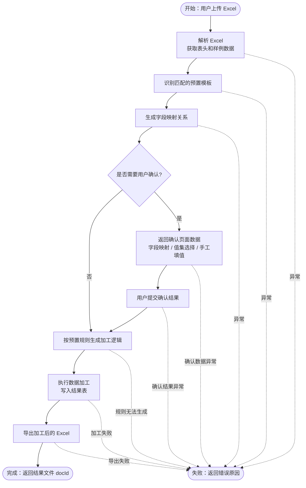

# Agent 整体流程图（测试用例设计版）

本文档用于帮助测试人员从业务视角理解数据加工 Agent 的主流程，并据此拆分测试用例。

## 简化流程图

## 测试关注点

- Excel 解析后是否能正确拿到表头和样例数据。
- 是否能根据表头和样例数据识别正确的预置模板。
- 字段映射关系是否完整覆盖加工规则需要的源字段。
- 明确映射、模糊映射、缺失映射是否能正确进入确认页面数据。
- 值集选择和手工填值确认项是否能正确生成。
- 用户提交确认结果后，是否能继续完成后续加工。
- 加工规则无法生成、字段缺失、确认结果非法、导出失败等异常场景是否返回明确错误原因。
