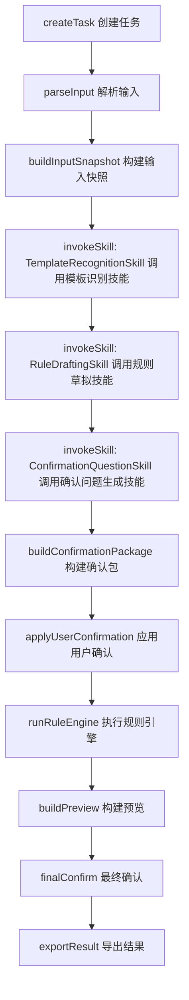
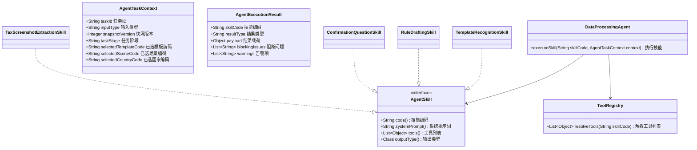
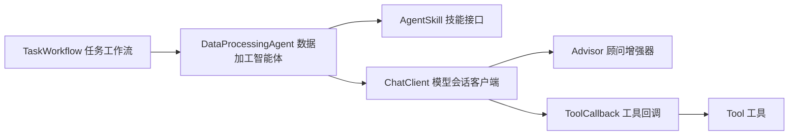
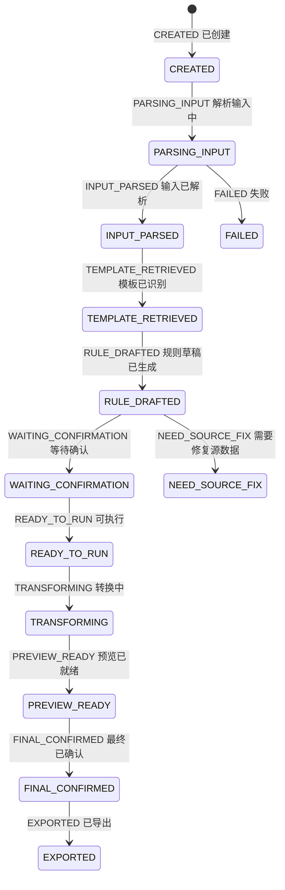

# AI 数据加工单智能体完整方案

> 说明
>
> - 本文档基于你纠正后的需求重新设计
> - 整个系统只有一个 `DataProcessingAgent 数据加工智能体`
> - 不再定义“模板识别智能体”“规则草稿智能体”等子智能体
> - 模板识别、规则草稿、确认问题生成等能力统一定义为 `skill 技能` 或 `tool 工具`
> - 本文档重点回答三件事：
>   - 单智能体整体架构怎么设计
>   - 到底定义哪些 `skill 技能`、哪些 `tool 工具`
>   - 采用 `workflow 工作流` 还是 `agentic mode 智能自治模式`

---

## 1. 先说结论

你的场景最合适的正式方案是：

`单智能体 + Java 显式工作流编排 + 受控 Skill/Tool + 非自治 Agentic`

换句话说：

- 整个系统只有一个智能体：`DataProcessingAgent 数据加工智能体`
- 智能体下面挂多种 `skill 技能`
- 技能可调用一组受控 `tool 工具`
- 主业务流程仍由 Java `workflow 工作流` 严格控制
- 不采用“让智能体自己自由决定下一步”的强自治 `agentic mode 智能自治模式`

这是本方案最核心的判断。

---

## 2. 为什么必须是单智能体

你的业务本质不是多角色协作，而是一个统一目标：

`把输入数据加工成目标结果，并在过程中完成识别、补全、确认、执行、预览和导出`

因此从业务视角看，最自然的抽象不是：

- 一个模板识别智能体
- 一个规则草稿智能体
- 一个确认智能体

而应该是：

- 一个 `DataProcessingAgent 数据加工智能体`

这个智能体在不同阶段切换不同技能：

- 识别模板时，调用 `TemplateRecognitionSkill 模板识别技能`
- 草拟规则时，调用 `RuleDraftingSkill 规则草拟技能`
- 生成确认问题时，调用 `ConfirmationQuestionSkill 确认问题生成技能`
- 处理税局截图时，调用 `TaxScreenshotExtractionSkill 税局截图提取技能`

也就是说：

- 智能体只有一个
- 技能可以有多个

---

## 3. 一页看全貌

## 3.1 一句话架构

`前端/接口 -> Java 工作流 -> DataProcessingAgent 单智能体 -> Skill 技能 -> Tool 工具 -> 规则引擎/存储/模型服务`

## 3.2 一张图看全链路

## 3.3 最核心的角色分工

- `DataProcessingAgent 数据加工智能体`
  负责统一 AI 决策能力入口

- `Skill 技能`
  负责定义“智能体在某个阶段怎么思考、可以用什么工具、输出什么结构”

- `Tool 工具`
  负责提供受控上下文和受控能力

- `Workflow 工作流`
  负责定义业务步骤顺序、状态推进、是否进入确认、是否允许执行

- `RuleEngine 规则引擎`
  负责真正执行全量数据转换

---

## 4. 这是 workflow 方案，不是强 agentic 方案

## 4.1 两种模式先区分

### `workflow mode 工作流模式`

含义：

- Java 代码预先定义好业务步骤
- 智能体在某些步骤中被调用
- 智能体不能任意跳步骤
- 智能体不能自己决定是否执行导出、是否推进状态

### `agentic mode 智能自治模式`

含义：

- 智能体根据目标自主规划步骤
- 智能体自主决定下一步调用哪个工具
- 智能体可以进行更开放式的试探和多轮规划

## 4.2 本项目为什么不适合强 agentic

你的项目有 5 个天然不适合强自治的特点：

1. 状态机非常清晰。
2. 数据转换要求确定性很强。
3. staging、确认、导出都有严格边界。
4. 模板与规则必须来自知识库事实源。
5. 不允许隐藏兜底和伪成功路径。

如果采用强 `agentic mode 智能自治模式`，风险很大：

- 智能体可能绕过确认
- 智能体可能过度调用工具
- 智能体可能推断出知识库之外的模板
- 智能体可能把阻断问题伪装成可执行结果

## 4.3 最终模式选择

本项目推荐：

- 主体采用 `workflow mode 工作流模式`
- 局部允许“受限 agentic”

这个“受限 agentic”只体现在：

- 某个 skill 内，模型可在限定工具集合中做少量工具调用决策
- 但整个任务流程顺序仍由 Java workflow 控制

所以最终是：

`Workflow-first, agentic-inside-skill`

中文解释：

- 外层是工作流优先
- 内层允许技能级小范围自治

---

## 5. 单智能体总体设计

## 5.1 单智能体定义

### `DataProcessingAgent 数据加工智能体`

定义：

统一负责 AI 相关判断、补全、提问生成和多模态理解的总智能体。

它不是总流程控制器，不负责执行全量规则转换，也不负责推进数据库状态。

### 核心职责

- 基于统一输入快照理解输入数据
- 从知识库事实源中识别模板
- 基于规则知识草拟 DSL
- 发现不确定项并生成确认问题
- 在图片场景下完成结构提取
- 产出结构化结果供 Java 工作流使用

### 不负责

- 推进任务状态
- 直接写数据库
- 执行全量数据转换
- 直接导出结果

## 5.2 单智能体统一输入

建议定义统一请求对象：

### `AgentTaskContext 智能体任务上下文`

字段示例：

- `taskId 任务ID`
- `inputType 输入类型`
- `snapshotVersion 快照版本`
- `taskStage 任务阶段`
- `selectedTemplateCode 已选模板编码`
- `selectedSceneCode 已选场景编码`
- `selectedCountryCode 已选国家编码`
- `confirmationConstraints 确认约束`

## 5.3 单智能体统一输出

建议定义统一输出外壳：

### `AgentExecutionResult 智能体执行结果`

字段示例：

- `skillCode 技能编码`
- `resultType 结果类型`
- `payload 结果载荷`
- `blockingIssues 阻断问题`
- `warnings 告警项`
- `toolCallSummary 工具调用摘要`

---

## 6. Skill 技能完整清单

下面是我建议你在正式版里定义的完整技能集合。

## 6.1 核心技能总表

| Skill 英文名 | Skill 中文名 | 是否一期必须 | 作用 |
|---|---|---|---|
| `TemplateRecognitionSkill` | 模板识别技能 | 是 | 根据输入快照和模板目录识别模板 |
| `RuleDraftingSkill` | 规则草拟技能 | 是 | 根据模板和规则知识生成 DSL 草稿 |
| `ConfirmationQuestionSkill` | 确认问题生成技能 | 是 | 生成单轮确认包中的问题 |
| `TaxScreenshotExtractionSkill` | 税局截图提取技能 | 是 | 处理税局截图特例 |
| `KnowledgeImportAssistSkill` | 知识导入辅助技能 | 否 | 解析上传知识包中的自然语言说明 |
| `RuleExplanationSkill` | 规则解释技能 | 否 | 面向前端或运营解释当前规则草稿 |
| `DataIssueDiagnosisSkill` | 数据问题诊断技能 | 否 | 解释为什么进入 NEED_SOURCE_FIX |

## 6.2 `TemplateRecognitionSkill 模板识别技能`

### 作用

从 `template_catalog.md` 或其数据库镜像中识别最匹配模板。

### 输入

- `InputSnapshot 统一输入快照`
- `TemplateCatalog 模板目录`
- `HeaderAlias 表头别名信息`

### 输出

- `templateCode 模板编码`
- `sceneCode 场景编码`
- `countryCode 国家编码`
- `confidence 置信度`
- `alternatives 候选项`
- `needUserConfirm 是否需要用户确认`

### 规则

- 只能从 catalog 中选
- 不能编造 catalog 外模板
- 不能把文件名当主信号
- 多候选冲突时必须保留冲突

## 6.3 `RuleDraftingSkill 规则草拟技能`

### 作用

根据已确定模板、规则知识、样本行和允许的 DSL 类型生成规则草稿。

### 输入

- `InputSnapshot 统一输入快照`
- `RuleKnowledge 规则知识`
- `DslSkeleton DSL骨架`
- `AllowedTransformTypes 允许的转换类型`

### 输出

- `draftDsl 草稿DSL`
- `ambiguousMappings 模糊映射`
- `missingFields 缺失字段`
- `defaultSuggestions 默认值建议`
- `blockingIssues 阻断问题`

### 规则

- 只能使用允许的 DSL 类型
- 不能偷偷发明转换逻辑
- 不能把无法判断的问题包装成成功

## 6.4 `ConfirmationQuestionSkill 确认问题生成技能`

### 作用

把模板冲突、规则歧义、默认值问题、数据源问题统一整理成“单轮确认包”。

### 输入

- 模板识别结果
- 规则草稿结果
- 数据质量问题

### 输出

- `questions 问题列表`
- `questionType 问题类型`
- `options 可选项`
- `recommendedOption 建议项`

### 规则

- 问题要合并，不能拆成多轮散问
- 问题表述必须稳定、可审计、可落库

## 6.5 `TaxScreenshotExtractionSkill 税局截图提取技能`

### 作用

处理税局网站截图场景，从多模态输入中提取固定结构。

### 输入

- 税局截图图片
- 固定 schema

### 输出

- `visibleFields 可见字段`
- `mappedRecord 映射记录`
- `snapshotData 快照数据`
- `confidenceSummary 置信度摘要`

### 规则

- 仅适用于税局截图
- 不得推广成任意图片技能

## 6.6 `KnowledgeImportAssistSkill 知识导入辅助技能`

### 作用

辅助解析知识包上传时的 `instructionText 自然语言说明`，把说明转成规则补充建议。

### 说明

这个技能建议二期再做，因为它不在主运行链路上。

## 6.7 `RuleExplanationSkill 规则解释技能`

### 作用

把当前 DSL 草稿翻译成运营或前端能看懂的解释文本。

### 说明

这个技能不进入核心执行链路，只用于增强可解释性。

---

## 7. Tool 工具完整清单

Tool 是这份方案里最需要收口的地方。下面我按类别完整列出建议清单。

## 7.1 Tool 总表

| Tool 英文名 | Tool 中文名 | 是否一期必须 | 类型 | 用途 |
|---|---|---|---|---|
| `LoadInputSnapshotTool` | 加载输入快照工具 | 是 | 只读上下文 | 读取统一输入快照 |
| `LoadSampleRowsTool` | 加载样本行工具 | 是 | 只读上下文 | 读取样本行 |
| `LoadTaskContextTool` | 加载任务上下文工具 | 是 | 只读上下文 | 读取任务上下文 |
| `ReadTemplateCatalogTool` | 读取模板目录工具 | 是 | 只读知识 | 读取模板目录 |
| `LookupHeaderAliasesTool` | 查询表头别名工具 | 是 | 只读知识 | 查询表头别名 |
| `ReadRuleKnowledgeTool` | 读取规则知识工具 | 是 | 只读知识 | 读取规则知识 |
| `BuildRuleDslSkeletonTool` | 构建规则DSL骨架工具 | 是 | 规则辅助 | 输出基础 DSL 骨架 |
| `ValidateDraftDslTool` | 校验草稿DSL工具 | 是 | 规则辅助 | 校验 DSL 草稿合法性 |
| `LoadAllowedTransformsTool` | 加载允许转换类型工具 | 是 | 规则辅助 | 返回允许的 transform 列表 |
| `LoadTaxScreenshotSchemaTool` | 加载税局截图结构工具 | 是 | 图片场景 | 返回固定 schema |
| `LoadOcrBlocksTool` | 加载OCR文本块工具 | 否 | 图片场景 | 查看 OCR 文本块 |
| `LoadConfirmationConstraintsTool` | 加载确认约束工具 | 否 | 只读上下文 | 返回确认问题组织规则 |
| `LoadEnumCandidatesTool` | 加载枚举候选工具 | 否 | 规则辅助 | 返回枚举值候选 |

## 7.2 `LoadInputSnapshotTool 加载输入快照工具`

### 作用

给智能体提供统一输入快照，包含：

- 表头
- 归一化表头
- 样本行
- 列统计
- 表头置信度

### 输入

- `taskId 任务ID`
- `snapshotVersion 快照版本`

### 输出

- `InputSnapshot 统一输入快照`

### 规则

- 只读
- 不允许修改快照

## 7.3 `ReadTemplateCatalogTool 读取模板目录工具`

### 作用

读取 `template_catalog.md` 或其数据库镜像中的模板目录。

### 输出

- `templateCode 模板编码`
- `scene 场景`
- `country 国家`
- `headers 模板列名集合`

### 规则

- 返回值必须结构化
- 不允许返回无来源模板

## 7.4 `LookupHeaderAliasesTool 查询表头别名工具`

### 作用

补充模板识别时的别名信息。

### 输出

- `headerAlias 表头别名`
- `normalizedAlias 归一化别名`
- `language 语言`
- `countryCode 国家编码`

## 7.5 `ReadRuleKnowledgeTool 读取规则知识工具`

### 作用

读取指定 `scene/country/template` 下的规则知识。

### 输出

- 当前规则文件
- 历史规则摘要
- 自然语言说明

### 规则

- 只读
- 不得返回无版本来源数据

## 7.6 `BuildRuleDslSkeletonTool 构建规则DSL骨架工具`

### 作用

基于模板字段和输入字段输出一个“空骨架”DSL，供智能体补全。

### 作用价值

这是非常关键的工具，因为它能防止模型随意发挥 DSL 结构。

## 7.7 `ValidateDraftDslTool 校验草稿DSL工具`

### 作用

校验草稿 DSL 是否：

- JSON 结构合法
- transform 类型合法
- 必填字段完整
- 目标字段重复冲突

### 输出

- `valid 是否合法`
- `issues 问题列表`

### 规则

- 这是 DSL 进入确认包前的最后一道 AI 边界校验

## 7.8 `LoadAllowedTransformsTool 加载允许转换类型工具`

### 作用

把系统允许的转换类型提供给智能体。

### 返回值

- `direct 直接映射`
- `constant 常量`
- `trim 去空格`
- `trim_upper 去空格转大写`
- `trim_lower 去空格转小写`
- `to_number 转数字`
- `to_date 转日期`
- `enum_map 枚举映射`
- `concat 拼接`
- `fallback 兜底取值`

## 7.9 `LoadTaxScreenshotSchemaTool 加载税局截图结构工具`

### 作用

给税局截图技能返回固定目标 schema。

### 规则

- 只用于税局截图场景

---

## 8. Skill 与 Tool 的映射关系

这一节用来快速回答“每个 skill 到底会用哪些 tool”。

## 8.1 映射总表

| Skill 技能 | 调用 Tool 工具 |
|---|---|
| `TemplateRecognitionSkill 模板识别技能` | `LoadInputSnapshotTool 加载输入快照工具`、`LoadSampleRowsTool 加载样本行工具`、`ReadTemplateCatalogTool 读取模板目录工具`、`LookupHeaderAliasesTool 查询表头别名工具` |
| `RuleDraftingSkill 规则草拟技能` | `LoadInputSnapshotTool 加载输入快照工具`、`ReadRuleKnowledgeTool 读取规则知识工具`、`BuildRuleDslSkeletonTool 构建规则DSL骨架工具`、`ValidateDraftDslTool 校验草稿DSL工具`、`LoadAllowedTransformsTool 加载允许转换类型工具` |
| `ConfirmationQuestionSkill 确认问题生成技能` | `LoadTaskContextTool 加载任务上下文工具`、`LoadConfirmationConstraintsTool 加载确认约束工具` |
| `TaxScreenshotExtractionSkill 税局截图提取技能` | `LoadTaxScreenshotSchemaTool 加载税局截图结构工具`、`LoadOcrBlocksTool 加载OCR文本块工具` |
| `KnowledgeImportAssistSkill 知识导入辅助技能` | `ReadTemplateCatalogTool 读取模板目录工具`、`ReadRuleKnowledgeTool 读取规则知识工具` |

## 8.2 一个重要结论

智能体不是直接碰数据库，而是：

- 智能体调用 skill
- skill 限定可用 tools
- tools 再由 Java 服务去读数据库/文件/知识库

这条链路是必须坚持的。

---

## 9. Workflow 与单智能体如何配合

## 9.1 不是“智能体接管流程”

本方案中，`DataProcessingAgent 数据加工智能体` 不是流程引擎。

它只在 workflow 定义的节点被调用。

## 9.2 推荐工作流

## 9.3 推荐的 workflow 类

### `TaskWorkflow 任务工作流`

方法建议：

- `createTask 创建任务`
- `parseInput 解析输入`
- `buildInputSnapshot 构建输入快照`
- `invokeTemplateRecognitionSkill 调用模板识别技能`
- `invokeRuleDraftingSkill 调用规则草拟技能`
- `invokeConfirmationQuestionSkill 调用确认问题生成技能`
- `buildConfirmationPackage 构建确认包`
- `applyUserConfirmation 应用用户确认`
- `runRuleEngine 执行规则引擎`
- `buildPreview 构建预览`
- `exportResult 导出结果`

---

## 10. 单智能体内部结构建议

## 10.1 关键类图

## 10.2 最关键的方法

### `executeSkill 执行技能`

这是单智能体的统一入口。

调用方式示意：

- workflow 指定当前要调用哪个 skill
- agent 读取该 skill 的 prompt、tools、output schema
- agent 使用 `Spring AI Alibaba` 发起调用
- agent 返回结构化结果

也就是说：

- 不是多个 agent
- 而是一个 agent 的多个 skill 执行入口

---

## 11. Spring AI Alibaba 在单智能体方案中的用法

## 11.1 用到哪些能力

- `ChatClient 模型会话客户端`
- `ToolCallback 工具回调`
- `Advisor 顾问增强器`
- 结构化输出
- 多模态能力

## 11.2 不建议用它做什么

- 不建议让它做主流程引擎
- 不建议让它决定任务状态机
- 不建议让它代替规则引擎
- 不建议让它直连数据库

## 11.3 推荐的调用结构

## 11.4 Advisor 建议

建议定义以下 `advisor 顾问增强器`：

- `KnowledgeBoundaryAdvisor 知识边界顾问`
  约束模型只能使用知识库事实源

- `NoFabricationAdvisor 禁止编造顾问`
  约束模型不得编造模板、规则、转换逻辑

- `ToolAuditAdvisor 工具审计顾问`
  记录工具调用摘要

- `ConfirmationGuardAdvisor 确认护栏顾问`
  约束不确定项必须进入确认包

---

## 12. 状态机仍然必须保留

虽然采用单智能体，但状态机不能被弱化。

重要规则：

- 状态机属于 workflow，不属于 agent

---

## 13. 这个方案下最重要的接口和对象

## 13.1 最重要的接口

### `DataProcessingAgent 数据加工智能体接口`

- `executeSkill 执行技能`

### `AgentSkill<R> 智能技能接口`

- `code 获取技能编码`
- `systemPrompt 获取系统提示词`
- `tools 获取工具列表`
- `outputType 获取输出类型`

### `AiTool<I, O> AI工具接口`

- `name 获取工具名`
- `description 获取工具说明`
- `execute 执行工具`

### `TaskWorkflow 任务工作流接口`

- `parseInput 解析输入`
- `invokeSkill 调用技能`
- `runRuleEngine 执行规则引擎`

## 13.2 最重要的对象

### `InputSnapshot 统一输入快照`

统一输入边界，Excel 和图片必须最终落到这里。

### `ConfirmationPackage 确认包`

统一的人机确认对象。

### `EffectiveRule 生效规则`

最终用于规则引擎执行的规则对象。

### `StagingResultRow 暂存结果行`

预览层的行级结果对象。

---

## 14. 分期建议

## 一期必须做

- `DataProcessingAgent 数据加工智能体`
- `TemplateRecognitionSkill 模板识别技能`
- `RuleDraftingSkill 规则草拟技能`
- `ConfirmationQuestionSkill 确认问题生成技能`
- `LoadInputSnapshotTool 加载输入快照工具`
- `ReadTemplateCatalogTool 读取模板目录工具`
- `ReadRuleKnowledgeTool 读取规则知识工具`
- `BuildRuleDslSkeletonTool 构建规则DSL骨架工具`
- `ValidateDraftDslTool 校验草稿DSL工具`
- `TaskWorkflow 任务工作流`
- `RuleEngine 规则引擎`
- staging 预览

## 二期建议做

- `TaxScreenshotExtractionSkill 税局截图提取技能`
- `KnowledgeImportAssistSkill 知识导入辅助技能`
- `RuleExplanationSkill 规则解释技能`
- `DataIssueDiagnosisSkill 数据问题诊断技能`

---

## 15. 最终结论

你纠正后的方向是对的，这个项目的正确抽象确实应该是：

- 一个 `DataProcessingAgent 数据加工智能体`
- 多个 `skill 技能`
- 一组受控 `tool 工具`
- 外层由 `workflow 工作流` 控制

而不是多个平级子智能体。

最终推荐结论可以压缩成 4 句话：

1. 整个系统只有一个智能体：`DataProcessingAgent 数据加工智能体`。
2. 模板识别、规则草拟、确认问题生成都定义为 `skill 技能`，不是子智能体。
3. 系统总体采用 `workflow mode 工作流模式`，不是强自治 `agentic mode 智能自治模式`。
4. 只允许在 skill 内部做小范围受限工具调用，不允许智能体接管整个业务流程。

