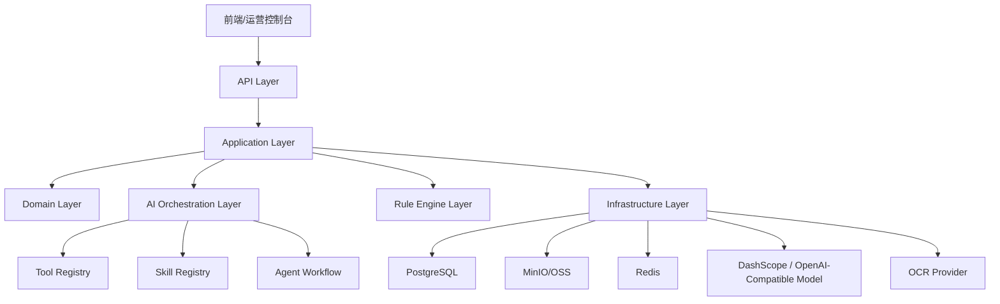
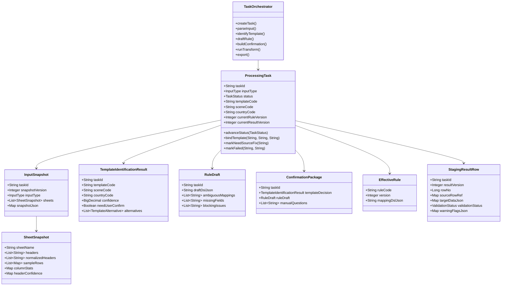
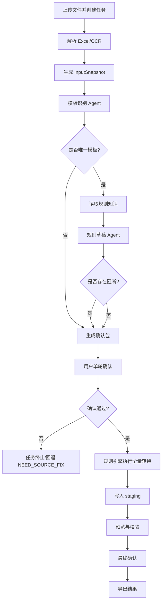
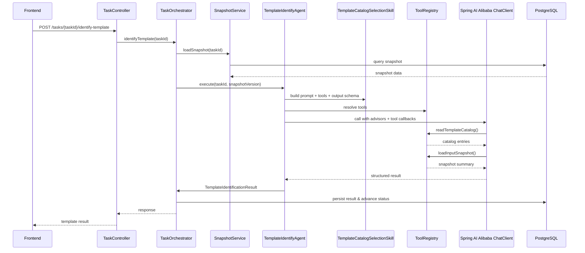
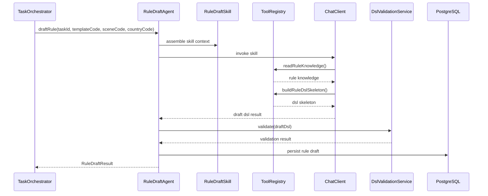
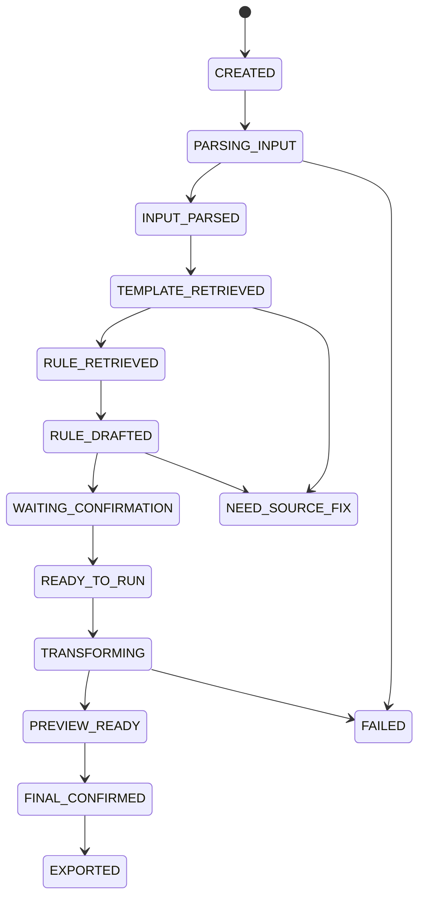

# 基于 Spring AI Alibaba 的 AI 数据加工正式设计方案

## 1. 文档目标

本文档基于现有 Python PoC 文档沉淀正式 Java 版实施方案，目标是：

- 保留 PoC 已验证的稳定边界
- 用 `Spring Boot + Spring AI Alibaba` 重建正式可扩展架构
- 明确 Agent、Tool、Skill、Workflow 的定义方式
- 输出可以直接指导建模、编码、评审的类图、时序图、流程图

## 2. PoC 已验证且必须继承的稳定边界

以下内容必须原样延续到 Java 正式版，不允许在实现时隐式改义：

- 统一输入模型：`InputSnapshot`
- 模板事实源：`template_catalog.md`
- 规则事实源：`knowledge_base/<scene>/<country>/rule.json`
- AI 只负责识别、判断、消歧、草稿补全
- 全量数据转换必须由规则引擎执行
- 单轮确认包是唯一人工交互入口
- 确认前结果必须进入 staging
- 状态机必须保留
- 图片链路与 Excel 链路最终都归一到统一快照

## 3. 正式版总体目标

正式版不是把 Python PoC 逐行翻译成 Java，而是做以下升级：

- 用 Spring 分层架构替代 PoC 级脚本/模块协作
- 用 `Spring AI Alibaba` 承接大模型调用、多模态、Tool Calling
- 用稳定领域对象承接任务、确认包、规则草稿、staging
- 用数据库保存运行态、版本态和审计态
- 将 AI 编排限制在显式 Agent/Skill/Tool 边界内，禁止散落到 service、controller、repository

## 4. 技术栈建议

- JDK 21
- Spring Boot 3.4.x
- Spring AI
- Spring AI Alibaba
- Spring Web
- Spring Validation
- Spring Data JPA 或 MyBatis Flex
- PostgreSQL 16+
- Redis
- MinIO 或 OSS
- Quartz 或 Spring Scheduler
- Micrometer + Prometheus + Grafana
- OpenTelemetry

建议原则：

- 运行态结构化数据进 PostgreSQL
- 文件原件、导出文件、OCR 中间产物进对象存储
- 短时缓存、幂等锁、任务协调进 Redis
- AI 调用配置统一走 Spring 配置中心或数据库配置表

## 5. 正式版分层架构



## 6. Maven 模块建议

```text
data-process-java/
  dp-bootstrap                 启动模块
  dp-api                       Controller / Request / Response
  dp-application               应用服务 / workflow / command
  dp-domain                    聚合根 / 实体 / 值对象 / 领域服务
  dp-ai                        Agent / Tool / Skill / Prompt / Advisor
  dp-parser                    Excel / OCR / Snapshot 构建
  dp-rule-engine               DSL 校验与执行
  dp-infrastructure            JPA / OSS / Redis / Model / OCR / MQ
  dp-common                    枚举 / 常量 / 错误码 / utils
  dp-test-support              测试夹具 / 模拟数据 / 集成测试支持
```

## 7. 领域模型设计

### 7.1 聚合划分

- `ProcessingTask`
  任务主聚合，管理状态机、输入类型、当前模板、当前规则版本、当前结果版本
- `InputSnapshotAggregate`
  管理统一输入快照及其多 sheet 结构
- `KnowledgePackageAggregate`
  管理模板 catalog、规则文件、知识包导入版本
- `ConfirmationAggregate`
  管理单轮确认包和用户确认结果
- `StagingAggregate`
  管理预览结果、预览摘要、校验状态

### 7.2 核心领域对象

- `ProcessingTask`
- `TaskFile`
- `InputSnapshot`
- `SheetSnapshot`
- `TemplateIdentificationResult`
- `RuleRetrievalResult`
- `RuleDraft`
- `ConfirmationPackage`
- `ConfirmationDecision`
- `EffectiveRule`
- `StagingResultRow`
- `StagingSummary`
- `ExportRecord`

## 8. 类图设计



## 9. 正式版包结构建议

```text
com.company.dataprocess
  .api
    .task
    .kb
    .model
  .application
    .service
    .workflow
    .command
    .query
  .domain
    .task
    .snapshot
    .kb
    .rule
    .staging
    .confirm
  .ai
    .agent
    .skill
    .tool
    .prompt
    .advisor
    .model
  .parser
    .excel
    .ocr
  .engine
    .dsl
    .executor
    .validator
  .infrastructure
    .persistence
    .storage
    .cache
    .llm
    .ocr
```

## 10. Spring AI Alibaba 下的核心设计思想

### 10.1 四层概念必须分开

- `Agent`
  面向一个业务决策目标的 AI 工作单元，例如模板识别 Agent、规则草稿 Agent
- `Skill`
  一组可复用的 AI 能力模板，通常由“提示词模板 + 可用工具集合 + 输出协议 + 约束”构成
- `Tool`
  供模型调用的外部能力，必须是可审计、可测试、可限权的 Java 方法
- `Workflow`
  由 Java 编排的业务流程，负责什么时候调用哪个 Agent，什么时候禁止 AI 自主推进

### 10.2 本项目中的定义方式

#### Agent 定义

- `TemplateIdentifyAgent`
- `RuleDraftAgent`
- `TaxScreenshotExtractAgent`
- 后续可扩展：
  - `ConfirmationQuestionAgent`
  - `RuleExplainAgent`

#### Skill 定义

- `TemplateCatalogSelectionSkill`
  只允许从 catalog 中选模板
- `RuleDraftSkill`
  只允许基于已选模板和规则事实源产出 DSL 草稿
- `TaxScreenshotExtractionSkill`
  只允许处理税局截图固定 schema
- `KnowledgeImportAssistSkill`
  用于知识包导入时提炼自然语言说明

#### Tool 定义

- `readTemplateCatalog`
- `readRuleKnowledge`
- `listTemplateCandidates`
- `loadInputSnapshot`
- `loadSampleRows`
- `lookupHeaderAliases`
- `buildRuleDslSkeleton`
- `loadTaxScreenshotSchema`
- `validateDraftDsl`

### 10.3 推荐实现原则

- Skill 不直接读数据库
- Tool 不直接改任务状态
- Agent 不直接调 repository
- Workflow 才能推进状态机
- Tool 返回结构化 DTO，禁止返回散乱字符串
- 所有 AI 输出都必须有结构化 schema 校验

## 11. Tool 设计详解

### 11.1 Tool 的边界

Tool 是给模型用的“受控函数”，不是把 service 全量暴露给模型。

必须满足：

- 单一职责
- 无隐式副作用，或副作用极小且可审计
- 参数有限且可校验
- 返回结构可被模型稳定消费

不建议暴露给模型的能力：

- `runTransform`
- `confirmTask`
- `exportFile`
- 任意 SQL 查询
- 任意文件系统读取

### 11.2 Tool 分类

#### 只读知识工具

- `TemplateCatalogTool`
- `RuleKnowledgeTool`
- `HeaderAliasLookupTool`

#### 只读任务上下文工具

- `InputSnapshotTool`
- `SampleRowTool`
- `TaskContextTool`

#### 规则辅助工具

- `DslSkeletonTool`
- `DslValidationTool`
- `EnumCandidatesTool`

#### 图片场景工具

- `TaxSchemaTool`
- `OcrBlockInspectionTool`

### 11.3 Tool Java 接口建议

```java
public interface AiTool<I, O> {
    String name();
    String description();
    O execute(I input);
}
```

### 11.4 Tool 示例

```java
public record ReadTemplateCatalogInput(
        String taskId
) {}

public record TemplateCatalogEntry(
        String templateCode,
        String scene,
        String country,
        List<String> headers
) {}

public record ReadTemplateCatalogOutput(
        List<TemplateCatalogEntry> entries
) {}

@Component
public class ReadTemplateCatalogTool {

    public ReadTemplateCatalogOutput readTemplateCatalog(ReadTemplateCatalogInput input) {
        // 从 knowledge_base/template_catalog.md 或其数据库镜像读取
        return new ReadTemplateCatalogOutput(List.of());
    }
}
```

### 11.5 Tool 注册建议

做统一注册中心，而不是分散在各 agent 里直接 new：

```java
public interface ToolRegistry {
    List<Object> toolsFor(String skillCode);
}
```

建议映射：

- `TEMPLATE_IDENTIFY` -> `loadInputSnapshot`, `readTemplateCatalog`, `lookupHeaderAliases`
- `RULE_DRAFT` -> `loadInputSnapshot`, `readRuleKnowledge`, `buildRuleDslSkeleton`, `validateDraftDsl`
- `TAX_SCREENSHOT` -> `loadInputSnapshot`, `loadTaxScreenshotSchema`

## 12. Skill 设计详解

### 12.1 Skill 的本质

本项目建议把 Skill 视为“受控 AI 能力包”，包含四部分：

- 固定系统提示
- 可调用工具列表
- 结构化输出 schema
- 行为护栏

### 12.2 Skill 抽象接口

```java
public interface AgentSkill<R> {
    String code();
    String systemPrompt();
    List<Object> tools();
    Class<R> outputType();
}
```

### 12.3 TemplateCatalogSelectionSkill

职责：

- 读取统一输入快照
- 读取模板目录
- 判断最相关模板
- 仅可在 catalog 中选择
- 多候选冲突时必须返回 `needUserConfirm=true`

系统提示核心约束建议：

- 不允许编造 catalog 之外模板
- 主识别信号是列名集合和样本值
- 文件名和 sheet 名不是主识别信号
- 无法唯一确认时必须返回候选列表

输出结构建议：

```java
public record TemplateIdentifyResult(
        String templateCode,
        String sceneCode,
        String countryCode,
        BigDecimal confidence,
        boolean needUserConfirm,
        List<TemplateAlternative> alternatives,
        String reasoningSummary
) {}
```

### 12.4 RuleDraftSkill

职责：

- 基于已识别模板和规则事实源生成 DSL 草稿
- 识别模糊映射、缺失字段、默认值建议、阻断问题
- 不允许偷偷补转换逻辑

输出结构建议：

```java
public record RuleDraftResult(
        String draftDsl,
        List<String> ambiguousMappings,
        List<String> missingFields,
        List<String> defaultSuggestions,
        List<String> blockingIssues,
        String reasoningSummary
) {}
```

### 12.5 TaxScreenshotExtractionSkill

职责：

- 仅服务于“税局网站截图”特例
- 抽取可见字段
- 落成统一快照
- 输出固定 schema 映射建议

注意：

- 这是场景化 skill，不可泛化成“任意图片理解 skill”

## 13. Agent 设计详解

### 13.1 Agent 抽象

```java
public interface BizAgent<I, O> {
    O execute(I input);
}
```

### 13.2 TemplateIdentifyAgent

输入：

- `taskId`
- `snapshotVersion`

依赖：

- `TemplateCatalogSelectionSkill`
- `ChatClient`
- 输出 schema 校验器

职责：

- 组装上下文
- 调用 skill
- 校验输出
- 转换为领域对象 `TemplateIdentificationResult`

### 13.3 RuleDraftAgent

输入：

- `taskId`
- `templateCode`
- `sceneCode`
- `countryCode`

依赖：

- `RuleDraftSkill`
- `DslValidationService`

职责：

- 拉取知识库规则上下文
- 让模型补全草稿
- 调用 DSL 校验
- 如校验失败，返回阻断问题，不允许假成功

## 14. Spring AI Alibaba 组件落位建议

### 14.1 推荐使用方式

- `ChatClient`
  统一构建 Agent 对话入口
- `Advisor`
  注入系统护栏、日志、审计、上下文增强
- `ToolCallback`
  将 Java Tool 暴露给模型调用
- 结构化输出
  用 JSON schema 或 Java record 约束输出

### 14.2 Advisor 链建议

```text
SafetyAdvisor
-> TaskContextAdvisor
-> KnowledgeBoundaryAdvisor
-> ToolAuditAdvisor
-> RetryGuardAdvisor
```

各自职责：

- `SafetyAdvisor`
  注入“不得编造模板、不得绕过 DSL、不得伪成功”
- `TaskContextAdvisor`
  注入任务 ID、输入类型、场景上下文
- `KnowledgeBoundaryAdvisor`
  强制模型只使用当前 catalog 和规则事实源
- `ToolAuditAdvisor`
  记录 tool 调用输入输出摘要
- `RetryGuardAdvisor`
  限制重复无效调用

### 14.3 ChatClient 工厂建议

```java
public interface AgentChatClientFactory {
    ChatClient create(String agentCode);
}
```

不同 agent 可有不同模型配置：

- 模板识别：偏推理稳定的文本模型
- 规则草稿：偏结构化输出稳定模型
- 税局截图：多模态模型

## 15. 正式版业务流程图



## 16. 模板识别时序图



## 17. 规则草稿时序图



## 18. 单轮确认包设计

确认包必须是正式领域对象，不是前端临时拼包。

建议结构：

```json
{
  "taskId": "xxx",
  "templateDecision": {
    "resolved": false,
    "selectedTemplateCode": null,
    "alternatives": []
  },
  "ruleDecision": {
    "draftDsl": "{}",
    "ambiguousMappings": [],
    "missingFields": [],
    "defaultSuggestions": [],
    "blockingIssues": []
  },
  "sourceDataIssues": [],
  "questions": []
}
```

确认包问题类型建议枚举：

- `TEMPLATE_CHOICE`
- `AMBIGUOUS_FIELD_MAPPING`
- `DEFAULT_VALUE_CONFIRM`
- `SOURCE_DATA_FIX_REQUIRED`
- `BLOCKING_RULE_DECISION`

## 19. 规则引擎设计

### 19.1 引擎职责

- 解释执行 DSL
- 执行全量行转换
- 生成行级预览结果
- 生成校验结果和告警

### 19.2 引擎边界

- 引擎不调用 LLM
- 引擎不读原始知识库 markdown
- 引擎只吃“确认后的 EffectiveRule + 输入快照/原始数据”

### 19.3 DSL 结构建议

```json
{
  "templateCode": "PAYMENT_INVOICE_STANDARD_US",
  "mappings": [
    {
      "targetField": "invoice_no",
      "transform": {
        "type": "direct",
        "source": "Invoice No"
      }
    }
  ]
}
```

建议 Java 模型：

- `DslRuleDefinition`
- `FieldMappingDefinition`
- `TransformDefinition`
- `ValidationIssue`

## 20. 数据库映射建议

### 20.1 延续 PoC 表意

沿用 `dp_`、`kb_` 前缀：

- `dp_task`
- `dp_task_file`
- `dp_input_snapshot`
- `dp_template_identification_result`
- `dp_rule_draft`
- `dp_confirmation_package`
- `dp_confirmation_result`
- `dp_effective_rule`
- `dp_staging_result`
- `dp_staging_summary`
- `dp_export_record`

### 20.2 正式版建议新增

- `dp_task_event`
  记录状态迁移与关键操作审计
- `dp_ai_call_log`
  记录 agent、model、prompt 摘要、tool 调用摘要、耗时
- `kb_template_catalog_entry`
  对 `template_catalog.md` 做数据库镜像，便于检索和版本审计
- `kb_rule_version`
  规则文件版本记录

## 21. 状态机设计



状态推进规则：

- 只有 `TaskOrchestrator` 可推进状态
- Tool、Skill、Agent、Repository 都无权推进状态

## 22. Excel 与图片双链路设计

### 22.1 Excel 主链路

```text
UploadFile
-> ExcelParser
-> HeaderNormalizer
-> SampleRowExtractor
-> InputSnapshotBuilder
-> TemplateIdentifyAgent
-> RuleDraftAgent
-> Confirmation
-> RuleEngine
-> Staging
-> Export
```

### 22.2 图片主链路

正式版建议拆成两层：

第一层，通用 OCR 链：

```text
UploadImage
-> OcrProvider
-> TableRebuilder
-> OcrSnapshotBuilder
-> InputSnapshot
```

第二层，税局截图特例链：

```text
UploadImage
-> TaxScreenshotExtractAgent
-> FixedSchemaSnapshotBuilder
-> InputSnapshot
-> FixedRuleSelection
-> Staging
```

建议保留明确场景开关，禁止把税局截图特例偷偷扩张成任意图片链路。

## 23. 接口设计建议

在 PoC 基础上，正式版建议补两个显式接口：

- `POST /api/v1/tasks/{taskId}/identify-template`
- `POST /api/v1/tasks/{taskId}/draft-rule`

原因：

- 让 Agent 调用成为显式业务动作
- 方便模型切换、压测、审计
- 避免把 AI 调用隐藏在“查询接口”里

其他接口可基本沿用 PoC 契约。

## 24. 关键实现类建议

### 24.1 API 层

- `TaskController`
- `KnowledgePackageController`
- `PreviewController`
- `ExportController`

### 24.2 Application 层

- `TaskOrchestrator`
- `KnowledgeImportApplicationService`
- `ConfirmationApplicationService`
- `PreviewApplicationService`
- `ExportApplicationService`

### 24.3 AI 层

- `TemplateIdentifyAgent`
- `RuleDraftAgent`
- `TaxScreenshotExtractAgent`
- `TemplateCatalogSelectionSkill`
- `RuleDraftSkill`
- `TaxScreenshotExtractionSkill`
- `ToolRegistryImpl`
- `AgentChatClientFactory`
- `ToolAuditAdvisor`
- `KnowledgeBoundaryAdvisor`

### 24.4 Domain 层

- `ProcessingTask`
- `TaskStatusMachine`
- `ConfirmationPackageFactory`
- `EffectiveRuleFactory`

### 24.5 Parser 层

- `ExcelSnapshotParser`
- `OcrSnapshotParser`
- `TableRebuilder`
- `HeaderNormalizer`

### 24.6 Rule Engine 层

- `DslParser`
- `DslValidator`
- `TransformExecutor`
- `PreviewAssembler`

## 25. Tool 与 Skill 的推荐映射表

| Skill | Tool | 用途 |
|---|---|---|
| `TemplateCatalogSelectionSkill` | `loadInputSnapshot` | 读取统一输入快照 |
| `TemplateCatalogSelectionSkill` | `readTemplateCatalog` | 读取模板目录 |
| `TemplateCatalogSelectionSkill` | `lookupHeaderAliases` | 查看表头别名 |
| `RuleDraftSkill` | `loadInputSnapshot` | 读取样本行与列信息 |
| `RuleDraftSkill` | `readRuleKnowledge` | 读取 scene/country 规则知识 |
| `RuleDraftSkill` | `buildRuleDslSkeleton` | 生成基础 DSL 骨架 |
| `RuleDraftSkill` | `validateDraftDsl` | 校验模型输出 DSL |
| `TaxScreenshotExtractionSkill` | `loadTaxScreenshotSchema` | 固定目标 schema |

## 26. Prompt / Skill 护栏建议

### 26.1 模板识别护栏

- 只能从 catalog 中选
- 不得推断 catalog 外模板
- 主信号是表头集合，不是文件名
- 无法唯一判断时必须返回候选列表

### 26.2 规则草稿护栏

- 只能使用允许的 DSL transform 类型
- 不得引入隐藏转换逻辑
- 不得将阻断问题包装成可运行规则
- 所有不确定点必须进入确认包

### 26.3 图片特例护栏

- 只对税局截图生效
- 不得泛化到其他图片
- 提取失败时必须显式失败

## 27. 可观测性与审计设计

### 27.1 必须记录

- 每次 agent 调用的模型、耗时、token、结果状态
- 每次 tool 调用的名称、入参摘要、出参摘要、耗时
- 每次状态迁移
- 每次确认包生成和用户确认结果

### 27.2 日志追踪字段

- `traceId`
- `taskId`
- `agentCode`
- `skillCode`
- `toolName`
- `modelName`
- `statusBefore`
- `statusAfter`

## 28. 测试策略

### 28.1 单元测试

- Header 归一化
- InputSnapshot 构建
- DSL 校验
- Rule 引擎转换
- 状态机推进

### 28.2 集成测试

- Excel 上传到快照生成
- 模板识别 Agent 结构化输出
- 规则草稿 Agent + DSL 校验
- 确认后规则执行到 staging
- 导出链路

### 28.3 回归样例库

延续 PoC 的固定样例集：

- 模板识别样例
- 规则草稿样例
- 税局截图样例
- 多模型对比样例

## 29. 分阶段落地建议

### Phase 1：基础骨架

- Spring Boot 工程初始化
- PostgreSQL 表结构
- 对象存储接入
- 任务、快照、知识库基础域对象
- Excel 解析链路

### Phase 2：AI 编排最小闭环

- `TemplateIdentifyAgent`
- `TemplateCatalogSelectionSkill`
- `readTemplateCatalog/loadInputSnapshot` tools
- 模板识别结果持久化

### Phase 3：规则草稿与确认闭环

- `RuleDraftAgent`
- `RuleDraftSkill`
- DSL 骨架与校验工具
- 确认包生成

### Phase 4：规则执行与 staging

- DSL 引擎
- 行级预览
- 预览摘要
- 最终确认与导出

### Phase 5：图片与多模态

- 通用 OCR 链
- 税局截图特例 Agent
- 图片样例回归测试

## 30. 明确禁止事项

- 在 controller/service 中散写 prompt
- 让模型直接访问 repository 或 SQL
- 让 tool 修改任务状态
- 在 DSL 外偷偷补转换逻辑
- 把图片特例伪装成通用图片能力
- 查询接口隐式触发 AI 调用
- 未经批准把确认环节自动跳过

## 31. 最终结论

如果以 `Spring AI Alibaba` 来承接正式版，最关键的不是“把模型接进来”，而是先把以下边界钉死：

- Java Workflow 负责流程和状态机
- Agent 负责单点 AI 决策
- Skill 负责能力封装和护栏
- Tool 负责受控上下文供给
- Rule Engine 负责全量可执行转换

对这个项目来说，最佳落地方式不是“大而全智能体”，而是：

1. 用 `TemplateIdentifyAgent` 做模板选择
2. 用 `RuleDraftAgent` 做 DSL 草稿补全
3. 用单轮确认包承接所有不确定性
4. 用 Java 规则引擎执行全量数据加工

这样既延续了 PoC 已验证的核心原则，也能最大化发挥 `Spring AI Alibaba` 在模型接入、Tool Calling、多模态和结构化输出上的优势，同时避免 AI 编排失控。
