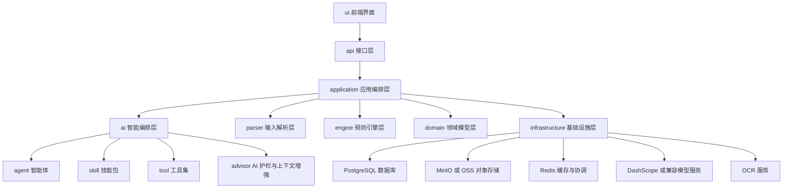
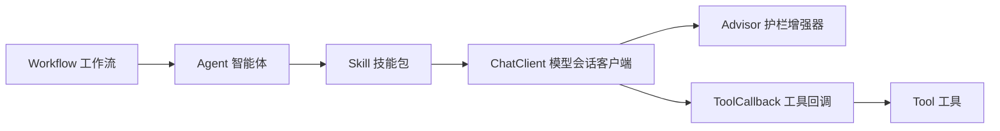
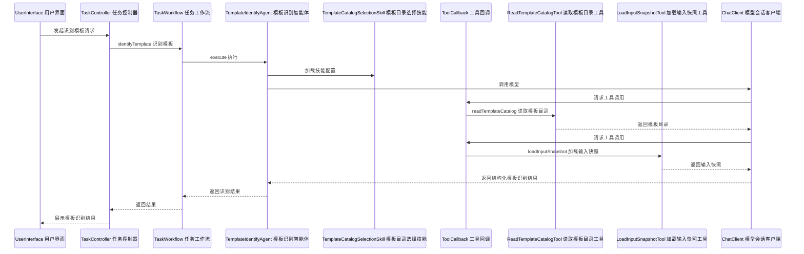
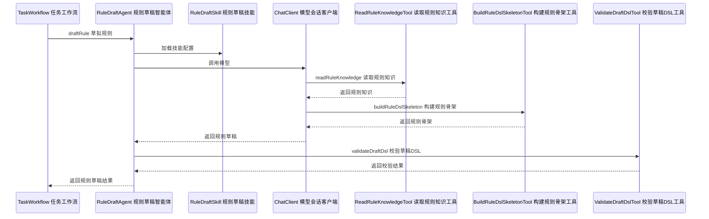
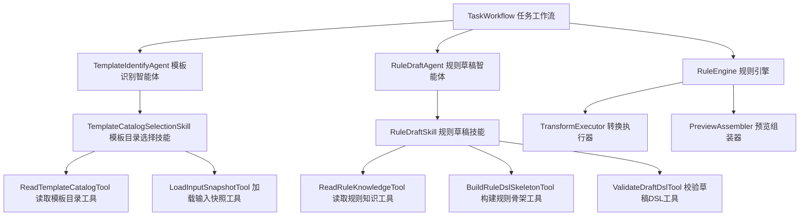
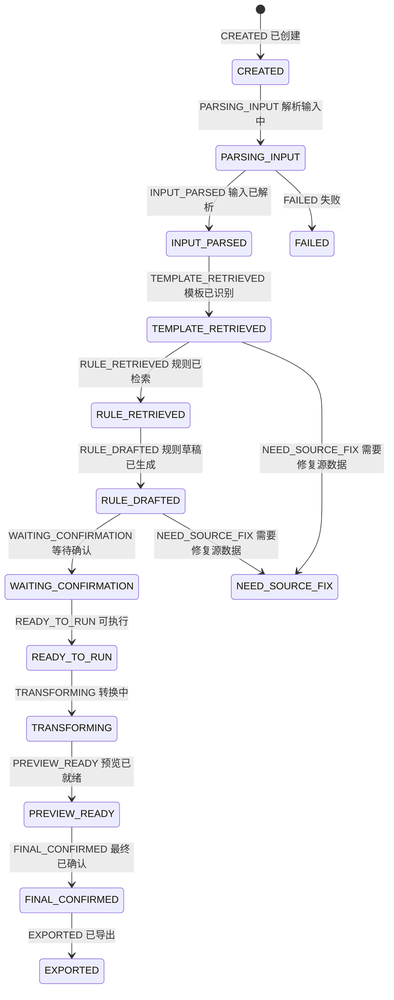

# AI 数据加工正式方案总览版

> 说明
>
> - 本文档是“便于快速看到全貌”的总览版方案
> - 不修改现有 [SPRING_AI_ALIBABA_DESIGN.md](</D:/lsy_projects/data_process_java/SPRING_AI_ALIBABA_DESIGN.md>)
> - 本文档中所有英文标识均附带中文说明，包含：包名、类名、接口名、方法名、字段名、枚举名、状态名

---

## 1. 一页看全貌

### 1.1 项目目标

把当前 Python PoC 升级为基于 `Spring Boot + Spring AI Alibaba` 的正式系统，用于处理：

- Excel 数据加工
- 图片 OCR 数据加工
- 模板识别
- 规则草稿生成
- 单轮人工确认
- 规则引擎执行
- staging 预览
- 最终导出

### 1.2 核心原则

系统必须始终遵守以下 6 条原则：

1. AI 只负责识别、判断、消歧、草稿补全。
2. AI 不直接处理全量原始数据。
3. 全量转换必须由 Java 规则引擎执行。
4. 所有不确定性统一进入单轮确认包。
5. 确认前结果只允许进入 staging，不允许写正式结果。
6. 模板和规则都必须来自知识库事实源，不允许模型编造。

### 1.3 一句话架构

一句话概括这套架构：

`Java 工作流编排 + Spring AI Alibaba 受控决策 + Tool 供给上下文 + Skill 封装 AI 能力 + Rule Engine 执行全量加工`

### 1.4 一张图看全链路

```mermaid
flowchart LR
    A["上传文件 UploadFile 上传文件"] --> B["解析输入 ParseInput 解析输入"]
    B --> C["生成快照 BuildInputSnapshot 生成统一输入快照"]
    C --> D["模板识别 Agent TemplateIdentifyAgent 模板识别智能体"]
    D --> E["规则草稿 Agent RuleDraftAgent 规则草稿智能体"]
    E --> F["确认包 BuildConfirmationPackage 生成确认包"]
    F --> G["人工确认 UserConfirmation 用户确认"]
    G --> H["规则执行 RuleEngineExecute 规则引擎执行"]
    H --> I["写入暂存 SaveToStaging 写入预览暂存区"]
    I --> J["预览 Preview 查看预览"]
    J --> K["最终确认 FinalConfirm 最终确认"]
    K --> L["导出 ExportResult 导出结果"]
```



### 1.5 一句话定义关键角色

- `Workflow 工作流`
  负责整个业务流程推进，是总导演。
- `Agent 智能体`
  负责一个具体 AI 决策任务。
- `Skill 技能包`
  负责把某类 AI 能力封装成“提示词 + tools + 输出协议 + 约束”。
- `Tool 工具`
  负责给模型提供受控上下文或受控能力。
- `Rule Engine 规则引擎`
  负责执行真正的数据转换。

---

## 2. 为什么这样设计

当前 PoC 已经证明了几个稳定事实：

- Excel 和图片最终都能归一到统一输入快照
- 模板识别的事实源是 `template_catalog.md`
- 规则知识的事实源是 `knowledge_base/<scene>/<country>/rule.json`
- 模型适合做识别、判断、补全，不适合逐行转换

因此正式版不能做成“一个大模型包打天下”，而要做成“AI 决策受控、规则执行确定”的架构。

这也是本方案最重要的设计判断：

- 让 AI 做不确定判断
- 让 Java 做确定执行

---

## 3. 系统全景架构

## 3.1 分层全景图



## 3.2 每层职责

### `api 接口层`

只做 3 件事：

- 接收请求
- 返回响应
- 调用应用服务

不允许：

- 写 prompt
- 写规则逻辑
- 写 AI 决策逻辑

### `application 应用编排层`

这是系统大脑，负责：

- 组织全流程
- 推进状态机
- 调用 parser、agent、rule engine、repository
- 生成确认包

### `ai 智能编排层`

负责：

- 组织 `Agent 智能体`
- 组织 `Skill 技能包`
- 注册 `Tool 工具`
- 配置 `Advisor 护栏`
- 对接 `Spring AI Alibaba`

### `parser 输入解析层`

负责：

- Excel 解析
- OCR 解析
- 统一快照构建

### `engine 规则引擎层`

负责：

- DSL 校验
- DSL 执行
- 行级转换
- 预览结果组装

### `domain 领域模型层`

负责：

- 任务对象
- 快照对象
- 确认包对象
- 规则对象
- staging 对象

### `infrastructure 基础设施层`

负责：

- 数据库存取
- 对象存储
- 缓存
- 模型调用
- OCR 接入

---

## 4. 正式版核心链路

## 4.1 Excel 链路

```text
上传 Excel
-> Excel 解析
-> 表头归一化
-> 样本行提取
-> 生成 InputSnapshot（统一输入快照）
-> 模板识别 Agent（模板识别智能体）
-> 规则草稿 Agent（规则草稿智能体）
-> 生成确认包
-> 用户确认
-> Rule Engine（规则引擎）执行
-> 写入 staging（预览暂存）
-> 预览
-> 最终确认
-> 导出
```

## 4.2 图片链路

正式版保留两条图片处理模式：

### 通用 OCR 图片链路

```text
上传图片
-> OCR Provider（OCR 服务提供方）
-> Table Rebuilder（表格重建器）
-> Ocr Snapshot Builder（OCR 快照构建器）
-> InputSnapshot（统一输入快照）
-> 后续与 Excel 链路合流
```

### 税局截图特例链路

```text
上传税局网站截图
-> TaxScreenshotExtractAgent（税局截图提取智能体）
-> FixedSchemaSnapshotBuilder（固定结构快照构建器）
-> InputSnapshot（统一输入快照）
-> 固定映射规则
-> staging（预览暂存）
```

注意：

- 税局截图特例只能作为显式场景能力存在
- 不允许把它偷偷泛化成“任意图片都能这么处理”

---

## 5. Spring AI Alibaba 在本项目里到底怎么用

## 5.1 不是“全系统 AI 化”

`Spring AI Alibaba` 在本项目里只用于这几类能力：

- 文本模型调用
- 多模态模型调用
- Tool Calling（工具调用）
- 结构化输出
- Advisor（上下文增强与护栏）
- Agent Workflow（智能体工作流）

它不负责：

- 数据库存储
- 全量数据转换
- 任务状态推进
- 最终导出

## 5.2 在本项目里的角色定位



一句话解释：

- `Workflow 工作流` 决定什么时候调用 AI
- `Agent 智能体` 决定要完成什么 AI 任务
- `Skill 技能包` 决定这次 AI 能用什么工具、必须遵守什么约束
- `Tool 工具` 负责把上下文安全地给模型

---

## 6. Tool、Skill、Agent、Workflow 的边界

这是你最关心、也最容易写乱的一部分，所以先给最清晰的定义。

## 6.1 `Workflow 工作流` 定义

### 定义

`Workflow 工作流` 是 Java 编排流程，不是模型自己跑的“自治流程”。

### 职责

- 调度系统流程
- 控制状态机
- 调用 parser / agent / engine / repository
- 决定是否进入确认
- 决定是否允许执行转换

### 代表类

- `TaskWorkflow 任务工作流`
- `KnowledgeImportWorkflow 知识导入工作流`

### 典型方法

- `createTask 创建任务`
- `parseInput 解析输入`
- `identifyTemplate 识别模板`
- `draftRule 草拟规则`
- `buildConfirmationPackage 构建确认包`
- `runTransformation 执行转换`
- `exportResult 导出结果`

### 结论

`Workflow 工作流` 是唯一允许推进任务状态的层。

## 6.2 `Agent 智能体` 定义

### 定义

`Agent 智能体` 是面向单一业务决策目标的 AI 执行单元。

### 职责

- 接收明确输入
- 调用模型
- 可通过 Tool 读取上下文
- 输出结构化结果

### 不负责

- 任务状态推进
- 直接操作数据库
- 全量数据转换

### 代表类

- `TemplateIdentifyAgent 模板识别智能体`
- `RuleDraftAgent 规则草稿智能体`
- `TaxScreenshotExtractAgent 税局截图提取智能体`

## 6.3 `Skill 技能包` 定义

### 定义

`Skill 技能包` 是一个“可复用的 AI 能力配置包”，本质上是：

- 一组系统提示词
- 一组可调用 tools
- 一个输出结构
- 一组行为护栏

### 代表类

- `TemplateCatalogSelectionSkill 模板目录选择技能`
- `RuleDraftSkill 规则草稿技能`
- `TaxScreenshotExtractionSkill 税局截图提取技能`

### 结论

`Skill 技能包` 不是业务流程，也不是工具实现，而是 AI 行为模板。

## 6.4 `Tool 工具` 定义

### 定义

`Tool 工具` 是暴露给模型调用的受控函数。

### 适合做 tool 的能力

- 读取输入快照
- 读取模板目录
- 读取规则知识
- 查看样本数据
- 校验 DSL

### 不适合做 tool 的能力

- 执行全量转换
- 修改任务状态
- 直接导出结果
- 任意 SQL 查询
- 任意文件访问

### 代表类

- `ReadTemplateCatalogTool 读取模板目录工具`
- `LoadInputSnapshotTool 加载输入快照工具`
- `ReadRuleKnowledgeTool 读取规则知识工具`
- `ValidateDraftDslTool 校验草稿 DSL 工具`

---

## 7. 本项目推荐的 AI 能力清单

## 7.1 Agent 清单

### `TemplateIdentifyAgent 模板识别智能体`

用途：

- 从 `template_catalog.md` 中识别最相关模板

输入：

- 统一输入快照
- 模板目录

输出：

- `templateCode 模板编码`
- `sceneCode 场景编码`
- `countryCode 国家编码`
- `confidence 置信度`
- `needUserConfirm 是否需要用户确认`
- `alternatives 候选列表`

### `RuleDraftAgent 规则草稿智能体`

用途：

- 基于已识别模板和知识库规则生成 DSL 草稿

输出：

- `draftDsl 草稿 DSL`
- `ambiguousMappings 模糊映射项`
- `missingFields 缺失字段`
- `defaultSuggestions 默认值建议`
- `blockingIssues 阻断问题`

### `TaxScreenshotExtractAgent 税局截图提取智能体`

用途：

- 处理税局网站截图场景

输出：

- `visibleFields 可见字段`
- `mappedRecord 映射记录`
- `snapshotData 快照数据`

## 7.2 Skill 清单

### `TemplateCatalogSelectionSkill 模板目录选择技能`

用途：

- 限制模型只能从模板目录中选模板

### `RuleDraftSkill 规则草稿技能`

用途：

- 限制模型只能使用允许的 DSL 类型来生成规则草稿

### `TaxScreenshotExtractionSkill 税局截图提取技能`

用途：

- 限制模型只处理税局截图固定 schema

## 7.3 Tool 清单

### 只读上下文工具

- `LoadInputSnapshotTool 加载输入快照工具`
- `LoadSampleRowsTool 加载样本行工具`
- `LoadTaskContextTool 加载任务上下文工具`

### 只读知识工具

- `ReadTemplateCatalogTool 读取模板目录工具`
- `ReadRuleKnowledgeTool 读取规则知识工具`
- `LookupHeaderAliasesTool 查询表头别名工具`

### 规则辅助工具

- `BuildRuleDslSkeletonTool 构建规则 DSL 骨架工具`
- `ValidateDraftDslTool 校验草稿 DSL 工具`

### 图片场景工具

- `LoadTaxScreenshotSchemaTool 加载税局截图结构工具`

---

## 8. 关键设计结论：必须这样约束 Tool 和 Skill

如果 `Tool 工具` 和 `Skill 技能包` 不先约束死，后面项目会非常容易散。

所以这里给出最重要的实施规则。

## 8.1 Tool 规则

1. Tool 必须单一职责。
2. Tool 必须返回结构化 DTO，不返回散乱字符串。
3. Tool 默认只读。
4. Tool 不能推进任务状态。
5. Tool 不能隐式执行业务动作。

## 8.2 Skill 规则

1. 每个 Skill 只服务一类 AI 任务。
2. 每个 Skill 必须有明确输出 schema。
3. 每个 Skill 必须声明可用 tools。
4. 每个 Skill 必须声明边界和禁止事项。
5. Skill 不能兼任工作流。

## 8.3 Agent 规则

1. Agent 必须面向单一目标。
2. Agent 输出必须结构化。
3. Agent 不能直接操作 repository。
4. Agent 不能绕过 Skill 自由拼 prompt。

## 8.4 Workflow 规则

1. Workflow 是唯一允许推进任务状态的层。
2. Workflow 是唯一允许决定“是否进入确认”的层。
3. Workflow 是唯一允许决定“是否执行规则引擎”的层。

---

## 9. 核心领域对象总览

## 9.1 核心对象图

```mermaid
classDiagram
    class ProcessingTask {
        +String taskId 任务ID
        +InputType inputType 输入类型
        +TaskStatus status 任务状态
        +String templateCode 模板编码
        +String sceneCode 场景编码
        +String countryCode 国家编码
        +Integer currentRuleVersion 当前规则版本
        +Integer currentResultVersion 当前结果版本
    }

    class InputSnapshot {
        +String taskId 任务ID
        +Integer snapshotVersion 快照版本
        +String inputType 输入类型
        +List~SheetSnapshot~ sheets sheet列表
    }

    class SheetSnapshot {
        +String sheetName sheet名称
        +List~String~ headers 原始表头
        +List~String~ normalizedHeaders 归一化表头
        +List~Map~ sampleRows 样本行
        +Map columnStats 列统计
        +Map headerConfidence 表头置信度
    }

    class TemplateIdentificationResult {
        +String templateCode 模板编码
        +String sceneCode 场景编码
        +String countryCode 国家编码
        +BigDecimal confidence 置信度
        +Boolean needUserConfirm 是否需要用户确认
    }

    class RuleDraft {
        +String draftDsl 草稿DSL
        +List~String~ ambiguousMappings 模糊映射
        +List~String~ missingFields 缺失字段
        +List~String~ blockingIssues 阻断问题
    }

    class ConfirmationPackage {
        +String taskId 任务ID
        +TemplateIdentificationResult templateDecision 模板决策
        +RuleDraft ruleDecision 规则决策
        +List~String~ questions 问题列表
    }

    class StagingResultRow {
        +Long rowNo 行号
        +Map sourceRowRef 源行引用
        +Map targetDataJson 目标数据
        +String validationStatus 校验状态
    }
```



## 9.2 最重要的领域对象解释

### `ProcessingTask 处理任务`

系统总任务对象。

负责记录：

- 当前状态
- 当前模板
- 当前规则版本
- 当前结果版本

### `InputSnapshot 统一输入快照`

这是全系统最关键的输入边界。

Excel 和图片最终都必须落到它上面。

### `ConfirmationPackage 确认包`

这是唯一合法的人机协作入口。

凡是不确定的地方，都必须进入这个对象，而不是偷偷自动推进。

### `StagingResultRow 暂存结果行`

确认后的规则执行结果先写到这里，供预览，不直接写最终产物。

---

## 10. 包结构设计

下面给出正式版推荐包结构，所有英文包名都附中文说明。

```text
com.company.dataprocess                          项目根包
  .api                                           接口层包
    .task                                        任务接口包
    .kb                                          知识库接口包
    .preview                                     预览接口包
    .export                                      导出接口包
  .application                                   应用编排层包
    .workflow                                    工作流包
    .service                                     应用服务包
    .command                                     写命令包
    .query                                       读查询包
  .domain                                        领域层包
    .task                                        任务领域包
    .snapshot                                    快照领域包
    .rule                                        规则领域包
    .confirm                                     确认领域包
    .staging                                     暂存领域包
    .kb                                          知识领域包
  .ai                                            AI 编排层包
    .agent                                       智能体包
    .skill                                       技能包包
    .tool                                        工具包
    .advisor                                     顾问增强包
    .prompt                                      提示词包
    .model                                       模型适配包
  .parser                                        输入解析层包
    .excel                                       Excel 解析包
    .ocr                                         OCR 解析包
  .engine                                        规则引擎层包
    .dsl                                         DSL 定义包
    .validator                                   校验器包
    .executor                                    执行器包
  .infrastructure                                基础设施层包
    .persistence                                 持久化包
    .storage                                     对象存储包
    .cache                                       缓存包
    .llm                                         模型调用包
    .ocr                                         OCR 接入包
```

---

## 11. 关键类、接口、方法总览

这一节专门用来让你快速看到“会有哪些类，会怎么协作”。

## 11.1 Workflow 类

### `TaskWorkflow 任务工作流`

职责：

- 编排任务主流程

建议方法：

- `createTask 创建任务`
- `parseInput 解析输入`
- `identifyTemplate 识别模板`
- `draftRule 草拟规则`
- `buildConfirmationPackage 构建确认包`
- `applyConfirmation 应用确认结果`
- `runTransformation 执行转换`
- `finalConfirm 最终确认`
- `exportResult 导出结果`

## 11.2 Agent 接口与实现

### `BizAgent<I, O> 业务智能体接口`

职责：

- 统一定义 AI 智能体输入输出协议

### `TemplateIdentifyAgent 模板识别智能体`

用途：

- 执行模板识别

### `RuleDraftAgent 规则草稿智能体`

用途：

- 执行规则草稿生成

### `TaxScreenshotExtractAgent 税局截图提取智能体`

用途：

- 执行税局截图提取

## 11.3 Skill 接口与实现

### `AgentSkill<R> 智能技能接口`

职责：

- 定义技能编号、系统提示词、可用 tools、输出类型

### `TemplateCatalogSelectionSkill 模板目录选择技能`

### `RuleDraftSkill 规则草稿技能`

### `TaxScreenshotExtractionSkill 税局截图提取技能`

## 11.4 Tool 接口与实现

### `AiTool<I, O> AI 工具接口`

职责：

- 统一定义工具元数据与执行协议

### 重点工具类

- `LoadInputSnapshotTool 加载输入快照工具`
- `ReadTemplateCatalogTool 读取模板目录工具`
- `ReadRuleKnowledgeTool 读取规则知识工具`
- `BuildRuleDslSkeletonTool 构建规则骨架工具`
- `ValidateDraftDslTool 校验草稿 DSL 工具`

## 11.5 Rule Engine 类

### `DslValidator DSL 校验器`

职责：

- 校验 DSL 是否合法

### `TransformExecutor 转换执行器`

职责：

- 逐行执行规则转换

### `PreviewAssembler 预览组装器`

职责：

- 组装预览摘要和预览明细

---

## 12. 时序图：让你快速看懂调用关系

## 12.1 模板识别时序图



## 12.2 规则草稿时序图



---

## 13. 流程图：确认 Tool、Skill、Agent 怎么参与



这张图背后的关键结论只有一句话：

- `Workflow 工作流` 调 Agent
- `Agent 智能体` 用 Skill
- `Skill 技能包` 管 Tool
- `Tool 工具` 供上下文
- `RuleEngine 规则引擎` 执行全量转换

---

## 14. 状态机设计



规则非常重要：

- 只有 `TaskWorkflow 任务工作流` 能推进这些状态

---

## 15. 数据库全貌

## 15.1 核心表分类

### 任务运行态表

- `dp_task 处理任务表`
- `dp_task_file 任务文件表`
- `dp_input_snapshot 输入快照表`
- `dp_template_identification_result 模板识别结果表`
- `dp_rule_draft 规则草稿表`
- `dp_confirmation_package 确认包表`
- `dp_confirmation_result 确认结果表`
- `dp_effective_rule 生效规则表`

### staging 预览表

- `dp_staging_result 暂存结果表`
- `dp_staging_summary 暂存汇总表`
- `dp_export_record 导出记录表`

### 知识库表

- `kb_template_catalog_entry 模板目录条目表`
- `kb_rule_version 规则版本表`

### 审计与可观测表

- `dp_task_event 任务事件表`
- `dp_ai_call_log AI 调用日志表`

## 15.2 最重要的字段

### `dp_task 处理任务表`

- `task_id 任务ID`
- `input_type 输入类型`
- `status 状态`
- `template_code 模板编码`
- `scene_code 场景编码`
- `country_code 国家编码`
- `current_rule_version 当前规则版本`
- `current_result_version 当前结果版本`

### `dp_input_snapshot 输入快照表`

- `task_id 任务ID`
- `snapshot_version 快照版本`
- `snapshot_json 快照JSON`

### `dp_staging_result 暂存结果表`

- `task_id 任务ID`
- `result_version 结果版本`
- `row_no 行号`
- `source_row_ref 源行引用`
- `target_data_json 目标数据JSON`
- `validation_status 校验状态`

---

## 16. DSL 设计全貌

当前系统允许的转换类型必须固定，不允许扩散。

### 支持的 `transformType 转换类型`

- `direct 直接映射`
- `constant 常量`
- `trim 去空格`
- `trim_upper 去空格并转大写`
- `trim_lower 去空格并转小写`
- `to_number 转数字`
- `to_date 转日期`
- `enum_map 枚举映射`
- `concat 拼接`
- `fallback 兜底取值`

### DSL 核心对象

- `DslRuleDefinition DSL 规则定义`
- `FieldMappingDefinition 字段映射定义`
- `TransformDefinition 转换定义`
- `ValidationIssue 校验问题`

### 核心原则

- 模型只能生成 DSL 草稿
- Java 规则引擎才是真正执行者

---

## 17. 关键接口全貌

正式版建议保留并强化以下接口。

### 任务接口

- `POST /api/v1/tasks/upload`
  上传并创建任务
- `GET /api/v1/tasks/{taskId}`
  查询任务摘要
- `GET /api/v1/tasks/{taskId}/input-snapshot`
  查询输入快照

### AI 显式接口

- `POST /api/v1/tasks/{taskId}/identify-template`
  显式触发模板识别
- `POST /api/v1/tasks/{taskId}/draft-rule`
  显式触发规则草稿生成

### 确认接口

- `GET /api/v1/tasks/{taskId}/confirmation-package`
  查询确认包
- `POST /api/v1/tasks/{taskId}/confirmation`
  提交确认结果

### 转换与预览接口

- `POST /api/v1/tasks/{taskId}/run`
  触发转换
- `GET /api/v1/tasks/{taskId}/preview-summary`
  查询预览摘要
- `GET /api/v1/tasks/{taskId}/preview-rows`
  查询预览分页

### 导出接口

- `POST /api/v1/tasks/{taskId}/final-confirm`
  最终确认
- `POST /api/v1/tasks/{taskId}/export`
  导出结果

---

## 18. 必须先做的第一期范围

如果你要快速启动正式开发，建议第一期只做这几件事：

### P1 基础链路

- Maven 多模块骨架
- PostgreSQL 基础表
- Excel 解析
- InputSnapshot 落库
- 模板目录读取

### P1 AI 能力

- `TemplateIdentifyAgent 模板识别智能体`
- `TemplateCatalogSelectionSkill 模板目录选择技能`
- `ReadTemplateCatalogTool 读取模板目录工具`
- `LoadInputSnapshotTool 加载输入快照工具`

### P1 规则能力

- `RuleDraftAgent 规则草稿智能体`
- `RuleDraftSkill 规则草稿技能`
- `BuildRuleDslSkeletonTool 构建规则骨架工具`
- `ValidateDraftDslTool 校验草稿DSL工具`

### P1 业务闭环

- 确认包生成
- 确认结果提交
- 基础 DSL 执行
- staging 预览

---

## 19. 明确禁止事项

这部分是为了防止后续开发失控。

1. 不允许在 `controller 控制器` 里写 prompt。
2. 不允许在 `service 服务` 里随手拼 AI 调用逻辑。
3. 不允许让 `Tool 工具` 修改任务状态。
4. 不允许让模型直接读数据库或执行 SQL。
5. 不允许让模型逐行处理全量数据。
6. 不允许把确认环节偷偷省略。
7. 不允许在 DSL 之外偷偷补转换逻辑。
8. 不允许把税局截图特例伪装成通用图片能力。

---

## 20. 最终结论

如果你要一句话判断这套方案是否合理，我给出的结论是：

这套系统最合适的正式化方式，不是“做一个超级大智能体”，而是：

- 用 `TaskWorkflow 任务工作流` 管总流程
- 用 `TemplateIdentifyAgent 模板识别智能体` 做模板选择
- 用 `RuleDraftAgent 规则草稿智能体` 做规则草稿
- 用 `Tool 工具` 给模型安全供给上下文
- 用 `Skill 技能包` 固定 AI 行为边界
- 用 `RuleEngine 规则引擎` 执行全量转换

这样做的最大好处是：

- 全貌清晰
- 职责不乱
- AI 可控
- 规则可执行
- 后期可扩展

如果你愿意，我下一步可以继续在“不写代码”的前提下，再补一版：

- “按业务视角”的方案
- 或“按类图视角”的方案
- 或“专门展开 Tool / Skill 定义规范”的方案

