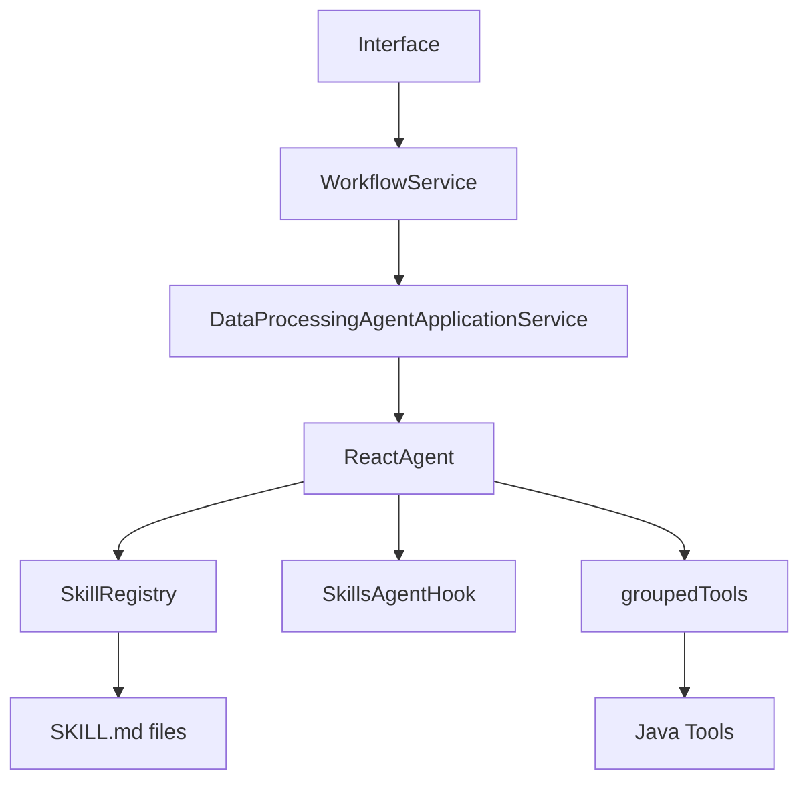

# Spring AI Alibaba 快速上手与代码级开发指南

面向人群：

- 还没有做过 AI 应用开发的 Java 程序员
- 熟悉 `Spring Boot`，希望直接开始写 Agent 应用
- 需要落地 `tool`、`skill`、`agent`、`workflow` 的工程实现

本文目标：

- 不是只讲概念，而是讲“代码怎么写”
- 帮你把 `Spring AI Alibaba` 放进熟悉的 `Spring Boot` 工程里
- 给出一套适合直接开工的最小代码骨架

阅读预期：

- 看完后，你应该能自己搭一个最小 Agent 项目
- 能实现一个 `tool`
- 能注册一个真实的 `SKILL.md`
- 能把 `skill + groupedTools + agent + workflow` 串起来

说明：

- 本文以“单智能体 + 多 skill + groupedTools + Java workflow”的模式展开
- 文中的类名和包名是推荐写法，实际可按团队命名规范调整
- `Spring AI` 与 `Spring AI Alibaba` 在不同版本上包名和 API 细节可能有小差异，真正编码前建议你对照当前项目依赖版本做一次校验

---

## 1. 先建立一个正确心智模型

先记住一句话：

`Spring AI Alibaba 不是替代 Spring 开发，而是让你用 Spring 的方式开发 AI 应用。`

对 Java 程序员来说，可以这样理解：

- `Interface`
  继续收请求
- `Service / Workflow`
  继续管业务流程
- `Repository`
  继续管数据库
- `AI Agent`
  负责做不确定性判断
- `Tool`
  是暴露给模型调用的受控 Java 能力
- `SKILL.md`
  是给 Agent 的任务说明书

所以这类项目的正确边界通常是：

- 模型负责识别、归纳、判断、草稿生成
- Java 负责状态流转、持久化、批处理、最终执行

一句话：

`模型做判断，Java 做落地。`

---

## 2. 你到底在写什么

如果你第一次做 AI 项目，最容易困惑的是：看起来东西很多，不知道哪些必须写，哪些只是扩展能力。

一个最小可运行的 `Spring AI Alibaba Agent` 项目，通常至少要有下面 6 类内容：

1. 依赖配置
2. 模型连接配置
3. `tool` 的 Java 实现
4. `SKILL.md` 文件
5. Agent 相关 Bean 配置
6. 业务调用入口

可以把整体工程看成这样：



职责分工非常明确：

- `SKILL.md`
  告诉模型“这次任务怎么做”
- `Tool`
  告诉模型“你能调用哪些后端能力”
- `ReactAgent`
  负责实际推理和多步工具调用
- `WorkflowService`
  决定“什么时候该调 Agent”

---

## 3. 核心概念用程序员语言解释

## 3.1 Model

模型就是一个远程推理服务。

你可以把它先类比成：

- 一个“更聪明但不稳定”的外部 API
- 输入是 prompt 和上下文
- 输出是文本、结构化对象，或者工具调用意图

工程重点不是研究它怎么训练，而是：

- 什么时候调用
- 调用前喂什么数据
- 输出怎么约束

## 3.2 Prompt

Prompt 不是注释，而是 AI 功能的一部分。

写 Java 接口时你会定义：

- 入参
- 出参
- 约束
- 错误处理

Prompt 做的也是同样的事情，只不过对象变成了大模型。

## 3.3 Tool

Tool 是模型可调用的后端能力。

本质上，它是：

- 一段受控 Java 代码
- 暴露给模型使用
- 输入受约束
- 输出受约束

常见用途：

- 读取任务上下文
- 查询模板目录
- 查询数据库摘要
- 校验规则草稿
- 获取 OCR 结构块

## 3.4 Skill

Skill 不是 Java 类本体，而是一个真实存在的 `SKILL.md` 文件。

它定义的是：

- 这个 AI 任务的目标
- 可以使用哪些工具
- 输出格式是什么
- 不允许做什么

可以把它理解成：

- `Tool` 是能力接口
- `Skill` 是任务说明书

## 3.5 Agent

Agent 是会结合上下文和工具、多步完成任务的执行单元。

在 `Spring AI Alibaba Agent Framework` 里，我们通常让它负责：

- 读取 skill
- 判断要不要调用 tool
- 基于 tool 返回结果继续推理
- 输出结构化结果

## 3.6 Workflow

Workflow 仍然应该由 Java 掌控。

它负责：

- 当前任务处在哪个阶段
- 现在该不该调用 Agent
- Agent 的结果是否需要人工确认
- 后续是否进入规则执行或落库

---

## 4. 推荐的项目目录结构

推荐先按下面结构组织：

```text
src/main/java/com/example/aiproject
├─ config
│  ├─ AiAgentConfig.java
│  └─ ToolConfig.java
├─ interfaces
│  └─ restful
│     └─ TemplateRecognitionInterface.java
├─ workflow
│  └─ TemplateRecognitionWorkflowService.java
├─ agent
│  └─ DataProcessingAgentApplicationService.java
├─ tool
│  ├─ TemplateCatalogTool.java
│  ├─ InputSnapshotTool.java
│  └─ HeaderAliasTool.java
├─ dto
│  ├─ TemplateRecognitionRequest.java
│  ├─ TemplateRecognitionResult.java
│  └─ ToolDtos.java
└─ repository
   └─ TemplateRepository.java

src/main/resources
├─ application.yml
└─ skills
   ├─ template-recognition
   │  └─ SKILL.md
   └─ rule-drafting
      └─ SKILL.md
```

这样做的好处是：

- `tool`、`agent`、`workflow` 职责清晰
- skill 文件可版本化管理
- 和现有 Spring Boot 工程习惯一致

---

## 5. 第一步：配置依赖

下面给出一个“最小起步思路”，重点是你需要哪些类型的依赖。

典型依赖会包括：

- `spring-boot-starter`
- `spring-boot-starter-web`
- `spring-ai-alibaba-starter`
- `spring-ai-alibaba-agent-framework-starter`
- 你所使用模型服务的 starter

示例 `pom.xml` 片段如下：

```xml
<dependencies>
    <dependency>
        <groupId>org.springframework.boot</groupId>
        <artifactId>spring-boot-starter-web</artifactId>
    </dependency>

    <dependency>
        <groupId>com.alibaba.cloud.ai</groupId>
        <artifactId>spring-ai-alibaba-starter</artifactId>
    </dependency>

    <dependency>
        <groupId>com.alibaba.cloud.ai</groupId>
        <artifactId>spring-ai-alibaba-agent-framework-starter</artifactId>
    </dependency>

    <dependency>
        <groupId>com.alibaba.cloud.ai</groupId>
        <artifactId>spring-ai-alibaba-dashscope-starter</artifactId>
    </dependency>

    <dependency>
        <groupId>org.springframework.boot</groupId>
        <artifactId>spring-boot-starter-validation</artifactId>
    </dependency>
</dependencies>
```

注意：

- 具体 artifact 名称要以你当前使用的版本和 BOM 为准
- 如果团队已经有统一 parent 或 dependencyManagement，优先沿用

---

## 6. 第二步：配置模型连接

最基础的 `application.yml` 可以先这样写：

```yaml
server:
  port: 8080

spring:
  application:
    name: spring-ai-alibaba-demo

  ai:
    dashscope:
      api-key: ${DASHSCOPE_API_KEY}
      chat:
        options:
          model: qwen-max

app:
  ai:
    skill-path: classpath:/skills
    agent-name: dataProcessingAgent
```

如果是本地文件系统管理 skills，也可以这样配：

```yaml
app:
  ai:
    skill-path: file:./skills
```

建议：

- 开发阶段用 `classpath:/skills`
  便于随应用打包
- 如果你希望运行时热更新 skill，可改成文件系统目录

---

## 7. 第三步：先定义结构化输出 DTO

不要先急着写 Prompt，先把你要的结果定义出来。

例如“模板识别”任务，可以先定义：

```java
package com.example.aiproject.dto;

import java.util.List;

public record TemplateRecognitionResult(
        String templateCode,
        String sceneCode,
        String countryCode,
        Double confidence,
        List<String> alternatives,
        Boolean needUserConfirm,
        String reason
) {
}
```

对应输入也先定义清楚：

```java
package com.example.aiproject.dto;

public record TemplateRecognitionRequest(
        String taskId
) {
}
```

为什么先做这一步：

- 你会更清楚 Agent 到底该产出什么
- Prompt、Tool、Workflow 都会更稳定
- 这和先设计接口 DTO 再写服务实现是同一思路

---

## 8. 第四步：实现 Tool

这是新手最应该先掌握的部分。

## 8.1 Tool 的设计原则

一个好用的 Tool，建议满足：

1. 单一职责
2. 输入简单
3. 输出结构化
4. 默认只读
5. 不推进主流程状态

例如，不要把下面两件事揉成一个 Tool：

- 读取模板目录
- 直接写入最终规则结果

这会让 Agent 权限边界变得很模糊。

## 8.2 一个典型 Tool 的写法

下面是一个“读取模板目录”的 Tool 示例。

```java
package com.example.aiproject.tool;

import com.example.aiproject.repository.TemplateRepository;
import org.springframework.ai.tool.annotation.Tool;
import org.springframework.stereotype.Component;

import java.util.List;

@Component
public class TemplateCatalogTool {

    private final TemplateRepository templateRepository;

    public TemplateCatalogTool(TemplateRepository templateRepository) {
        this.templateRepository = templateRepository;
    }

    @Tool(name = "readTemplateCatalog", description = "读取模板目录，返回可选模板列表")
    public List<TemplateCatalogItem> readTemplateCatalog(String sceneCode) {
        return templateRepository.findByScene(sceneCode)
                .stream()
                .map(template -> new TemplateCatalogItem(
                        template.code(),
                        template.sceneCode(),
                        template.countryCode(),
                        template.headers()
                ))
                .toList();
    }

    public record TemplateCatalogItem(
            String templateCode,
            String sceneCode,
            String countryCode,
            List<String> headers
    ) {
    }
}
```

这个类里最重要的是：

- `@Component`
  交给 Spring 管理
- `@Tool`
  把方法声明为模型可调用工具

这里的本质是：

- 你的 Tool 仍然是普通 Spring Bean
- 只是其中某个方法被框架识别成可供模型调用的函数

## 8.3 再看一个读取快照 Tool

```java
package com.example.aiproject.tool;

import org.springframework.ai.tool.annotation.Tool;
import org.springframework.stereotype.Component;

@Component
public class InputSnapshotTool {

    @Tool(name = "loadInputSnapshot", description = "根据任务ID读取输入快照")
    public InputSnapshotDto loadInputSnapshot(String taskId) {
        return new InputSnapshotDto(
                taskId,
                "invoice-import",
                new String[]{"invoice_no", "invoice_date", "amount"},
                """
                Row1: invoice_no=INV001, invoice_date=2026-05-01, amount=100
                Row2: invoice_no=INV002, invoice_date=2026-05-02, amount=250
                """
        );
    }

    public record InputSnapshotDto(
            String taskId,
            String inputType,
            String[] normalizedHeaders,
            String sampleRows
    ) {
    }
}
```

建议注意两点：

- 不要直接把整份大文件原样塞给模型
- 优先给“快照”“样本”“摘要”“归一化结果”

---

## 9. 第五步：把 Tool 注册成 ToolCallback

`@Tool` 只是声明了“这是工具方法”，但 Agent 真正能调用，通常还要把这些工具装配成 `ToolCallback`。

一个推荐写法如下：

```java
package com.example.aiproject.config;

import com.example.aiproject.tool.HeaderAliasTool;
import com.example.aiproject.tool.InputSnapshotTool;
import com.example.aiproject.tool.TemplateCatalogTool;
import org.springframework.ai.tool.ToolCallback;
import org.springframework.ai.tool.support.ToolCallbacks;
import org.springframework.context.annotation.Bean;
import org.springframework.context.annotation.Configuration;

@Configuration
public class ToolConfig {

    @Bean
    public ToolCallback[] templateRecognitionToolCallbacks(
            TemplateCatalogTool templateCatalogTool,
            InputSnapshotTool inputSnapshotTool,
            HeaderAliasTool headerAliasTool
    ) {
        return ToolCallbacks.from(
                templateCatalogTool,
                inputSnapshotTool,
                headerAliasTool
        );
    }
}
```

说明：

- `ToolCallbacks.from(...)`
  会扫描对象上的 `@Tool` 方法并转成框架可调用的 callback
- 这一步之后，Agent 才能把这些 Java 方法当成工具使用

版本差异提示：

- 如果你使用的版本 API 稍有不同，可能看到的是 `List<ToolCallback>` 或其他 builder 风格
- 原理不变：都是把带 `@Tool` 的 Bean 转成模型可调用的工具集合

---

## 10. 第六步：按 skill 分组暴露 groupedTools

这是整个方案里非常关键的一步。

为什么不能把所有 Tool 都暴露给所有 skill？

因为一旦全量暴露：

- 权限边界会失控
- 调试会变难
- 模型会在太大工具集里乱选
- 某个 skill 可能调用到本不该调用的能力

所以推荐按 skill 进行工具分组。

示例配置如下：

```java
package com.example.aiproject.config;

import org.springframework.ai.tool.ToolCallback;
import org.springframework.context.annotation.Bean;
import org.springframework.context.annotation.Configuration;

import java.util.List;
import java.util.Map;

@Configuration
public class GroupedToolConfig {

    @Bean
    public Map<String, List<ToolCallback>> groupedTools(
            ToolCallback[] templateRecognitionToolCallbacks
    ) {
        return Map.of(
                "template-recognition", List.of(templateRecognitionToolCallbacks)
        );
    }
}
```

这里建议你遵守一个约定：

- `groupedTools` 的 key
  直接对应 skill 目录名或 skill 名称

例如：

- `template-recognition`
- `rule-drafting`
- `confirmation-question`

这样最不容易乱。

如果后面你要扩展多个技能组，可以这样写：

```java
@Bean
public Map<String, List<ToolCallback>> groupedTools(
        ToolCallback[] templateRecognitionToolCallbacks,
        ToolCallback[] ruleDraftingToolCallbacks,
        ToolCallback[] confirmationToolCallbacks
) {
    return Map.of(
            "template-recognition", List.of(templateRecognitionToolCallbacks),
            "rule-drafting", List.of(ruleDraftingToolCallbacks),
            "confirmation-question", List.of(confirmationToolCallbacks)
    );
}
```

---

## 11. 第七步：创建真实的 SKILL.md

这是 `Spring AI Alibaba` 技能体系和“手写一个普通 prompt 字符串”最不一样的地方。

我们不是把 skill 写成 Java 类，而是写成真实文件。

目录示例：

```text
src/main/resources/skills/template-recognition/SKILL.md
```

推荐内容如下：

```md
# Template Recognition Skill

## Purpose

根据输入快照和模板目录，识别最匹配的模板。

## When To Use

- 当前任务需要从已有模板目录中匹配模板
- 输入已经完成快照提取

## Allowed Tools

- loadInputSnapshot
- readTemplateCatalog
- lookupHeaderAliases

## Output Contract

输出 JSON 对象，包含以下字段：

- templateCode
- sceneCode
- countryCode
- confidence
- alternatives
- needUserConfirm
- reason

## Constraints

- 只能从模板目录中选择模板
- 不允许编造不存在的模板
- 低置信度时必须返回 alternatives
- 如果信息不足，needUserConfirm 必须为 true

## Forbidden Actions

- 不允许跳过工具直接编造答案
- 不允许输出未定义字段
```

建议统一所有 skill 的章节结构，这样：

- 便于治理
- 便于 code review
- 便于多人协作

---

## 12. 第八步：注册 SkillRegistry

如果你希望框架自动发现并管理这些 `SKILL.md`，就需要注册 `SkillRegistry`。

常见方式有两种：

- `ClasspathSkillRegistry`
  从类路径加载 skills
- `FileSystemSkillRegistry`
  从文件系统目录加载 skills

一个典型写法如下：

```java
package com.example.aiproject.config;

import org.springframework.beans.factory.annotation.Value;
import org.springframework.context.annotation.Bean;
import org.springframework.context.annotation.Configuration;

// 这里的类名请以你当前依赖版本的实际包名为准
import com.alibaba.cloud.ai.agent.skill.SkillRegistry;
import com.alibaba.cloud.ai.agent.skill.ClasspathSkillRegistry;

@Configuration
public class SkillConfig {

    @Bean
    public SkillRegistry skillRegistry(
            @Value("${app.ai.skill-path:classpath:/skills}") String skillPath
    ) {
        return new ClasspathSkillRegistry(skillPath);
    }
}
```

如果你想用本地文件系统目录：

```java
import com.alibaba.cloud.ai.agent.skill.FileSystemSkillRegistry;

@Bean
public SkillRegistry skillRegistry(
        @Value("${app.ai.skill-path:file:./skills}") String skillPath
) {
    return new FileSystemSkillRegistry(skillPath);
}
```

原理可以简单理解为：

- `SkillRegistry` 会扫描 skill 根目录
- 找到每个子目录下的 `SKILL.md`
- 把这些 skill 注册到 Agent 可访问的技能集合里

---

## 13. 第九步：注册 SkillsAgentHook

有了 `SkillRegistry` 之后，通常还要把它接到 Agent 上。

这里常见会用到 `SkillsAgentHook`。

它的作用可以简单理解成：

- 把可用 skill 列表接入 Agent
- 提供 `read_skill` 这类能力给 Agent
- 让 Agent 在运行时知道有哪些技能可读、可用

典型配置示例如下：

```java
package com.example.aiproject.config;

import com.alibaba.cloud.ai.agent.hook.SkillsAgentHook;
import com.alibaba.cloud.ai.agent.skill.SkillRegistry;
import org.springframework.context.annotation.Bean;
import org.springframework.context.annotation.Configuration;

import java.util.Map;
import java.util.List;
import org.springframework.ai.tool.ToolCallback;

@Configuration
public class SkillHookConfig {

    @Bean
    public SkillsAgentHook skillsAgentHook(
            SkillRegistry skillRegistry,
            Map<String, List<ToolCallback>> groupedTools
    ) {
        return SkillsAgentHook.builder()
                .skillRegistry(skillRegistry)
                .groupedTools(groupedTools)
                .build();
    }
}
```

这一步很关键，因为它把两件事绑在一起了：

- skill 从哪里读
- 每个 skill 能用哪些工具

也就是说：

- `skill` 定义任务边界
- `groupedTools` 定义能力边界

---

## 14. 第十步：注册 SkillPromptAugmentAdvisor

这个组件的作用，可以简单理解成“在模型执行前，把技能上下文增强进 prompt”。

典型配置如下：

```java
package com.example.aiproject.config;

import com.alibaba.cloud.ai.agent.advisor.SkillPromptAugmentAdvisor;
import com.alibaba.cloud.ai.agent.skill.SkillRegistry;
import org.springframework.context.annotation.Bean;
import org.springframework.context.annotation.Configuration;

@Configuration
public class AdvisorConfig {

    @Bean
    public SkillPromptAugmentAdvisor skillPromptAugmentAdvisor(
            SkillRegistry skillRegistry
    ) {
        return SkillPromptAugmentAdvisor.builder()
                .skillRegistry(skillRegistry)
                .build();
    }
}
```

它的作用不要理解得太复杂。

先把它类比成：

- 一个 prompt 增强器
- 一个给 Agent 注入技能上下文的顾问

---

## 15. 第十一步：创建 ReactAgent

你可以把 `ReactAgent` 先理解成：

`一个会思考、会选工具、会多步执行的 Agent 实现`

这里的 “React” 指的是 “Reason + Act”，不是前端 React。

典型配置如下：

```java
package com.example.aiproject.config;

import com.alibaba.cloud.ai.agent.ReactAgent;
import com.alibaba.cloud.ai.agent.hook.SkillsAgentHook;
import org.springframework.ai.chat.client.ChatClient;
import org.springframework.context.annotation.Bean;
import org.springframework.context.annotation.Configuration;

@Configuration
public class AiAgentConfig {

    @Bean
    public ReactAgent dataProcessingAgent(
            ChatClient.Builder chatClientBuilder,
            SkillsAgentHook skillsAgentHook
    ) {
        return ReactAgent.builder()
                .name("dataProcessingAgent")
                .chatClient(chatClientBuilder.build())
                .agentHook(skillsAgentHook)
                .build();
    }
}
```

如果你的版本要求注入 advisor，也可能会是类似下面的风格：

```java
@Bean
public ReactAgent dataProcessingAgent(
        ChatClient.Builder chatClientBuilder,
        SkillsAgentHook skillsAgentHook,
        SkillPromptAugmentAdvisor skillPromptAugmentAdvisor
) {
    return ReactAgent.builder()
            .name("dataProcessingAgent")
            .chatClient(
                    chatClientBuilder
                            .defaultAdvisors(skillPromptAugmentAdvisor)
                            .build()
            )
            .agentHook(skillsAgentHook)
            .build();
}
```

这里要抓住本质，不要死记 builder 细节：

- `ReactAgent` 需要模型客户端
- 需要知道有哪些 skills
- 需要知道每个 skill 可调用哪些 tools

---

## 16. 第十二步：封装 Agent 调用服务

不要在 Interface 里直接拼 prompt 和调 Agent。

建议专门做一个 `AgentService`。

示例：

```java
package com.example.aiproject.agent;

import com.alibaba.cloud.ai.agent.ReactAgent;
import com.example.aiproject.dto.TemplateRecognitionResult;
import org.springframework.stereotype.Service;

@Service
public class DataProcessingAgentApplicationService {

    private final ReactAgent dataProcessingAgent;

    public DataProcessingAgentApplicationService(ReactAgent dataProcessingAgent) {
        this.dataProcessingAgent = dataProcessingAgent;
    }

    public TemplateRecognitionResult recognizeTemplate(String taskId) {
        String userPrompt = """
                请执行 template-recognition skill。
                当前任务ID为：%s
                你必须返回符合输出契约的 JSON 结果。
                """.formatted(taskId);

        String content = dataProcessingAgent.run(userPrompt);

        return JsonUtils.fromJson(content, TemplateRecognitionResult.class);
    }
}
```

这里故意保持简单，目的是说明职责：

- `AgentService`
  负责跟 Agent 打交道
- `WorkflowService`
  负责决定何时调用它

实际项目里建议：

- 封装统一的 JSON 解析
- 增加异常处理
- 增加输出合法性校验
- 增加审计日志

---

## 17. 第十三步：由 Workflow 控制业务主流程

这一层非常重要。

因为很多新人会把 Agent 当成总控，这是最容易失控的地方。

推荐写法如下：

```java
package com.example.aiproject.workflow;

import com.example.aiproject.application.service.DataProcessingAgentApplicationService;
import com.example.aiproject.dto.TemplateRecognitionResult;
import org.springframework.stereotype.Service;

@Service
public class TemplateRecognitionWorkflowService {

    private final DataProcessingAgentApplicationService agentService;

    public TemplateRecognitionWorkflowService(DataProcessingAgentApplicationService agentService) {
        this.agentService = agentService;
    }

    public TemplateRecognitionResult execute(String taskId) {
        TemplateRecognitionResult result = agentService.recognizeTemplate(taskId);

        if (Boolean.TRUE.equals(result.needUserConfirm())) {
            return result;
        }

        // 这里继续进入你的确定性业务逻辑
        // 例如：保存模板识别结果、推进任务状态、触发后续规则草稿环节
        return result;
    }
}
```

这个例子表达的是：

- Agent 负责判断
- Workflow 决定下一步

不要反过来。

---

## 18. 第十四步：提供 Interface

到这一步就能对外暴露一个最小接口了。

```java
package com.example.aiproject.interfaces.restful;

import com.example.aiproject.dto.TemplateRecognitionRequest;
import com.example.aiproject.dto.TemplateRecognitionResult;
import com.example.aiproject.workflow.TemplateRecognitionWorkflowService;
import jakarta.validation.Valid;
import org.springframework.web.bind.annotation.*;

@RestController
@RequestMapping("/api/template-recognition")
public class TemplateRecognitionInterface {

    private final TemplateRecognitionWorkflowService workflowService;

    public TemplateRecognitionInterface(TemplateRecognitionWorkflowService workflowService) {
        this.workflowService = workflowService;
    }

    @PostMapping
    public TemplateRecognitionResult recognize(
            @Valid @RequestBody TemplateRecognitionRequest request
    ) {
        return workflowService.execute(request.taskId());
    }
}
```

至此，你已经完成了一条完整链路：

- HTTP 请求进来
- Java Workflow 决定调用 Agent
- Agent 读取对应 skill
- Agent 在 skill 允许范围内调用 tools
- Agent 返回结构化结果
- Workflow 再决定是否继续后续业务步骤

---

## 19. 原理速览：tool、skill、agent 到底是怎么串起来的

这里不讲太细，只讲程序员需要知道的关键原理。

## 19.1 Tool 原理

`@Tool` 的本质是：

- 把某个 Spring Bean 方法声明为“可供模型调用的函数”
- 框架会把方法签名、名称、描述整理成工具元数据
- 模型在推理时决定是否调用它

调用流程可以简化理解为：

```text
模型判断需要工具
-> 框架匹配对应 ToolCallback
-> 调用 Java 方法
-> Java 返回结构化结果
-> 结果再回到模型上下文
-> 模型继续推理
```

## 19.2 Skill 原理

`SKILL.md` 的本质是：

- 给 Agent 的一份结构化任务说明
- 不只是普通文本，而是框架可发现、可管理的技能资源

`SkillRegistry` 的工作是：

- 扫描 skill 目录
- 加载每个 `SKILL.md`
- 注册为可用技能

## 19.3 groupedTools 原理

`groupedTools` 的本质是工具权限边界。

它告诉框架：

- `template-recognition` 这个 skill 只能看到哪组工具
- `rule-drafting` 这个 skill 又只能看到另一组工具

这样模型不是拿到全量能力，而是拿到“当前任务允许使用的那部分能力”。

## 19.4 Agent 原理

`ReactAgent` 的本质是一个带工具调用能力的推理执行器。

它大致会做这些事情：

1. 读取用户输入
2. 结合技能上下文理解任务
3. 决定要不要调用工具
4. 调工具拿数据
5. 基于工具结果继续推理
6. 输出最终答案

## 19.5 Workflow 原理

Workflow 不参与“模型怎么思考”，它负责：

- 当前该不该调用 Agent
- Agent 的输出是否合法
- 后续要不要确认、落库、执行规则

所以它是系统的主流程控制器。

---

## 20. 推荐的 skill 标准模板

为了让团队成员都能写出结构一致的 skill，建议统一用下面的结构：

```md
# Skill Name

## Purpose

说明这个技能的目标。

## When To Use

说明什么场景下调用它。

## Input Expectations

说明调用前应具备哪些输入上下文。

## Allowed Tools

- toolA
- toolB

## Output Contract

说明必须返回哪些字段，是否必须返回 JSON。

## Constraints

说明允许做什么、不允许做什么、低置信度怎么处理。

## Forbidden Actions

列出明确禁止项。
```

推荐所有 skill 都统一要求：

- 只返回结构化结果
- 低置信度必须显式表达
- 不允许编造知识库之外的事实
- 不允许越权调用未分配工具

---

## 21. 适合当前项目的 Tool 划分建议

结合你当前项目“图片数据解析转换并落库”的场景，比较适合把 Tool 分成下面几组。

## 21.1 template-recognition-tools

适合模板识别 skill：

- `loadInputSnapshot`
- `loadSampleRows`
- `readTemplateCatalog`
- `lookupHeaderAliases`

## 21.2 rule-drafting-tools

适合规则草稿 skill：

- `readRuleKnowledge`
- `buildRuleDslSkeleton`
- `loadAllowedTransforms`
- `validateDraftDsl`

## 21.3 confirmation-tools

适合确认问题生成 skill：

- `loadTaskContext`
- `loadConfirmationConstraints`

## 21.4 tax-screenshot-tools

适合税局截图识别或图片结构提取 skill：

- `loadTaxScreenshotSchema`
- `loadOcrBlocks`

这里最重要的不是名字，而是原则：

- 每个 skill 只看见与自己任务直接相关的工具

---

## 22. 新人最容易踩的坑

## 22.1 把 Tool 写成“大而全服务”

坏例子：

- 一个 Tool 里既查数据、又做转换、又落库、又推进状态

正确做法：

- 一个 Tool 只暴露单一能力

## 22.2 把 Skill 当成普通 Prompt 文本

Skill 应该有固定结构、固定目录、固定治理方式，而不是某个 Java 字符串常量。

## 22.3 让 Agent 直接操作最终业务状态

例如：

- 直接改任务状态
- 直接写正式结果表
- 直接触发最终导出

这些都不推荐。

## 22.4 不设计低置信度分支

AI 系统不是每次都能确定。

必须提前设计：

- `needUserConfirm`
- `alternatives`
- `reason`

## 22.5 给模型喂过多原始数据

优先喂：

- 快照
- 摘要
- 样本
- 归一化结果

不要直接把几十万行原始数据全文扔给模型。

---

## 23. 从 0 到 1 的最小落地顺序

如果你准备真正在项目里开工，建议按这个顺序：

1. 先选一个单任务场景，比如“模板识别”。
2. 先定义结构化输出 DTO。
3. 实现 2 到 3 个只读 Tool。
4. 写一个真实的 `SKILL.md`。
5. 注册 `SkillRegistry`。
6. 配好 `groupedTools`。
7. 创建 `SkillsAgentHook` 和 `ReactAgent`。
8. 用 `AgentService` 封装调用。
9. 用 `WorkflowService` 串起来。
10. 最后再扩展到规则草稿、确认问题、图片场景。

这条顺序对 Java 团队特别友好，因为它非常接近常规后端开发节奏。

---

## 24. 一份最小可运行清单

如果你想快速自查，最小可运行版本至少应包含：

- `application.yml`
- 一个模型配置
- 一个 `@Tool` Bean
- 一个 `ToolCallbacks.from(...)` 装配
- 一个 `groupedTools` Bean
- 一个 `SkillRegistry` Bean
- 一个 `SkillsAgentHook` Bean
- 一个 `ReactAgent` Bean
- 一个 `SKILL.md`
- 一个 `AgentService`
- 一个 `WorkflowService`
- 一个测试接口

只要这些都具备，你就已经不是“在研究概念”，而是真的进入开发阶段了。

---

## 25. 对当前项目的直接建议

结合你当前仓库里的设计方向，推荐你按下面的方式落地：

- 只有一个 `DataProcessingAgent`
- skill 用真实 `SKILL.md` 管理
- tool 用 Java Bean + `@Tool` 实现
- 用 `ToolCallbacks` 转成工具回调
- 用 `groupedTools` 按 skill 做权限隔离
- 用 `SkillRegistry + SkillsAgentHook` 把 skill 体系接入 agent
- 外层始终由 Java workflow 掌控

如果再压缩成一句话，就是：

`一个 Agent，多个 SKILL.md，按 skill 分组暴露 tools，外层流程继续由 Java 控制。`

这条路线非常适合你当前“图片数据解析转换并落库”的场景，因为它既保留了 AI 的判断能力，也保留了工程系统应有的可控性。

---

## 26. 收尾建议

如果你准备继续往下做，不建议下一步再写一篇更抽象的介绍文档，而是直接开始补两类内容：

1. 当前项目的真实代码骨架
2. 当前项目的真实 `SKILL.md` 模板

也就是说，下一阶段最值得做的不是继续解释概念，而是把下面这些文件真正落进仓库：

- `ToolConfig.java`
- `SkillConfig.java`
- `AiAgentConfig.java`
- `DataProcessingAgentApplicationService.java`
- `TemplateRecognitionWorkflowService.java`
- `skills/template-recognition/SKILL.md`

这样团队成员就能从“知道是什么”直接进入“照着写”。
