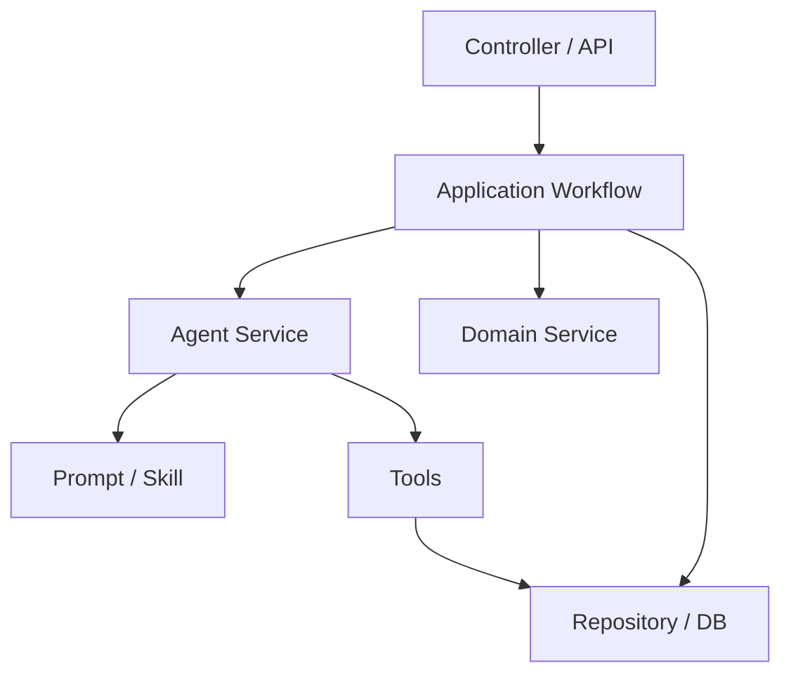

# Spring AI Alibaba 快速上手指南

面向人群：

- 还没做过 AI 应用开发的 Java 程序员
- 熟悉 `Spring Boot`，但不熟悉 `Prompt`、`Tool`、`Agent`
- 希望尽快开始做一个可控、可维护的 Agent 应用

本文目标：

- 用 Java 开发者熟悉的方式理解 `Spring AI Alibaba`
- 建立“做 AI 应用到底在写什么”的基本心智模型
- 给出一条从 0 到 1 的 Agent 设计与开发路径

---

## 1. 一句话理解 Spring AI Alibaba

`Spring AI Alibaba` 可以理解为：

`让 Java / Spring Boot 开发者用熟悉的工程方式构建大模型应用和 Agent 应用的一套框架能力`

如果你以前写的是：

- Web 接口
- 数据库读写
- 消息消费
- 调用第三方 HTTP 服务

那么现在只是多了一类“外部能力”：

- 调用大模型
- 给大模型喂上下文
- 让大模型按约束调用工具
- 把大模型的输出重新纳入你的业务流程

本质上，它不是“魔法框架”，而是把 AI 能力纳入 `Spring` 工程体系。

---

## 2. 它解决的核心问题是什么

一个没接触过 AI 应用的 Java 程序员，第一次做项目通常会遇到 4 个问题：

1. 不知道怎么调用模型才像工程代码，而不是脚本拼接。
2. 不知道怎么把数据库、检索、HTTP 接口这类业务能力安全地提供给模型。
3. 不知道怎么把提示词、工具、上下文、输出格式组织起来。
4. 不知道怎么把“模型很聪明但不稳定”这件事，放进可测试、可治理的系统里。

`Spring AI Alibaba` 的价值就在这里：

- 用 Spring 风格组织模型调用
- 用框架能力组织 `Prompt`、`Tool`、`Advisor`、`Memory`、`Agent`
- 让 AI 应用从“Demo”走向“可维护系统”

---

## 3. Java 开发者最该先建立的心智模型

先记住一句话：

`AI 应用 = 大模型 + 上下文 + 工具 + 流程控制`

把它翻译成 Java 工程语言，就是：

- `大模型`
  像一个能力很强、但不稳定的远程推理服务
- `Prompt`
  像你给这个服务写的“任务说明书”
- `Tool`
  像你暴露给模型调用的受控 Java 能力
- `Advisor`
  像模型调用前后的增强器或拦截器
- `Memory`
  像会话上下文存储
- `Agent`
  像一个会思考、会选工具、会多步执行的 AI 执行单元
- `Workflow`
  像业务主流程编排器，负责决定什么时候调用 Agent、什么时候调用普通服务

最重要的工程判断是：

`不要让 Agent 接管整个系统，而要让 Agent 只负责它擅长的那部分不确定性决策。`

例如：

- 适合交给 Agent：分类、识别、归纳、草稿生成、消歧、问答
- 不适合交给 Agent：扣库存、改状态机、全量批处理、最终记账、强一致写库

---

## 4. Spring AI Alibaba 里最值得先理解的几个概念

## 4.1 Model

模型是推理核心。

你可以把它理解为：

- 一个能力很强的文本推理服务
- 输入是 prompt 和上下文
- 输出是文本，或结构化结果，或工具调用意图

对 Java 开发者来说，重点不是“模型原理”，而是：

- 什么时候该调用它
- 调用前给它什么上下文
- 如何约束它的输出

## 4.2 Prompt

Prompt 不是“随便写几句提示词”，而是 AI 功能的接口定义。

一个好的 Prompt 通常要说清楚：

- 你是谁
- 你的任务是什么
- 你可以使用哪些工具
- 你不能做什么
- 你的输出必须长什么样

如果把 Java 接口设计得很严谨，但 Prompt 写得很随意，Agent 的稳定性通常不会好。

## 4.3 Tool

Tool 是 Java 程序员最容易理解、也最重要的部分。

你可以把 Tool 理解为：

`提供给模型调用的一组受控后端能力`

例如：

- 查数据库
- 读取文件摘要
- 查询模板目录
- 调用 OCR 服务
- 校验 DSL

设计 Tool 时建议遵守 4 条原则：

1. 单一职责，只做一件事。
2. 默认只读，能不写就不写。
3. 返回结构化结果，不返回随意长文本。
4. 不让 Tool 偷偷推进主业务状态。

## 4.4 Advisor

Advisor 可以理解为模型调用链路上的增强器。

常见用途：

- 注入系统提示
- 注入技能上下文
- 做审计日志
- 做安全约束
- 做调用前后加工

如果你熟悉 Spring 拦截器、过滤器、AOP，就可以把它先这样类比理解。

## 4.5 Memory

Memory 用于让模型“记住前文”。

但工程里要谨慎：

- 对话类产品通常需要 Memory
- 任务类系统通常只需要“任务上下文”，不一定需要长会话记忆

很多项目一开始就引入复杂 Memory，最后反而更难调试。

## 4.6 Agent

Agent 不是简单聊天机器人。

更准确地说：

`Agent 是一个能基于目标、上下文和工具，多步完成任务的 AI 执行单元。`

它通常具备这些特点：

- 理解任务
- 判断下一步该做什么
- 选择是否调用 Tool
- 基于 Tool 结果继续推理
- 输出最终结果

对业务系统来说，Agent 更像“受限自治执行器”。

---

## 5. 对新手最实用的 Agent 设计方法

很多人第一次做 Agent，容易一上来就做一个“大而全总智能体”。这通常会失控。

更推荐下面这套方法。

## 5.1 先找出“哪里不确定”

先不要问“我要不要上 Agent”，先问：

`当前业务流程里，哪些步骤是规则写不死、但人一看就能判断的？`

这些步骤最适合 Agent。

例如：

- 识别用户意图
- 判断文档属于哪一类
- 从多个模板里选最可能的一个
- 生成规则草稿
- 把多个问题合并成一轮确认问题

## 5.2 把确定性流程留给 Java

这些事情优先用普通 Java 代码：

- 状态流转
- 数据落库
- 权限校验
- 批量执行
- 事务处理
- 最终导出

一个好用的经验法则是：

`模型做判断，Java 做落地。`

## 5.3 先做单 Agent，再考虑多 Agent

对大部分业务系统，第一阶段优先做：

- 一个主 Agent
- 多个可复用 Skill
- 一组受控 Tool
- 一个 Java Workflow

不要太早做多 Agent 协作，原因很简单：

- 调试更难
- 成本更高
- 可观测性更差
- 失败路径更多

## 5.4 给 Agent 明确边界

你要让 Agent 清楚知道：

- 它当前只负责什么
- 它可以调用哪些工具
- 它不能自己做哪些业务决定
- 它的输出格式是什么

边界越清楚，系统越稳定。

---

## 6. 一个适合 Java 团队的落地分层

推荐按下面方式理解整体结构：



各层职责建议如下：

- `Controller / API`
  接请求、回结果，不直接写 AI 逻辑
- `Application Workflow`
  编排整个业务流程，决定何时调用 Agent
- `Agent Service`
  封装模型调用、工具调用、技能选择
- `Prompt / Skill`
  描述当前 AI 任务怎么做
- `Tools`
  提供受控业务能力
- `Domain Service / Repository`
  处理确定性业务逻辑和持久化

如果一句话概括：

`Agent 是能力节点，不是系统总控。`

---

## 7. 一个最小可行的 Agent 开发步骤

如果你的目标是“尽快上手”，建议按下面顺序来。

## 7.1 第一步：先做一个单一任务

不要一开始就做“通用企业知识问答平台”。

优先选择：

- 输入清晰
- 输出清晰
- 成功标准清晰

例如：

- 根据输入内容识别模板
- 根据工单内容生成结构化摘要
- 根据文档片段判断所属分类

## 7.2 第二步：先固定输出格式

先定义你真正想要的结构化结果，比如：

```json
{
  "category": "invoice",
  "confidence": 0.92,
  "reason": "包含发票号码、税额、开票日期等字段"
}
```

然后再反推 Prompt 和 Tool。

这和先设计 DTO 再写实现，是同一个思路。

## 7.3 第三步：只暴露必要 Tool

如果当前任务只是“识别模板”，那就只给它：

- 读输入快照
- 读模板目录
- 查表头别名

不要顺手把“写正式结果”“删任务”“执行导出”也暴露给它。

## 7.4 第四步：把失败路径也设计出来

很多 AI Demo 只设计成功路径，但正式系统更关心失败路径。

至少要考虑：

- 模型不确定怎么办
- 候选项冲突怎么办
- Tool 没数据怎么办
- 输出不合法怎么办
- 是否需要人工确认

## 7.5 第五步：再做评估与迭代

评估一个 Agent，不要只看“它感觉挺聪明”。

更应关注：

- 准确率
- 稳定性
- 可解释性
- 工具调用是否合理
- 失败是否可回退

---

## 8. 一个非常实用的 Agent 设计模板

你可以把每个 Agent 任务都先写成下面 6 个问题：

1. 目标是什么？
2. 输入是什么？
3. 允许使用哪些 Tool？
4. 禁止做什么？
5. 输出格式是什么？
6. 失败时如何降级？

例如一个“模板识别 Agent”可以这样定义：

- 目标：从已有模板目录中识别最匹配模板
- 输入：输入快照、样本行、表头归一化结果
- Tool：读取快照、读取模板目录、查询别名
- 禁止：编造不存在的模板；跳过不确定性说明
- 输出：模板编码、场景编码、国家编码、置信度、候选项
- 降级：低置信度时返回候选项并进入人工确认

这套模板对新人非常有效，因为它能把“抽象 AI 设计”变成“清晰接口设计”。

---

## 9. 推荐的 Skill 与 Tool 拆分方式

如果你要做一个业务 Agent，通常建议这样拆：

### Skill 负责什么

- 定义任务目标
- 定义允许使用的工具范围
- 定义输出协议
- 定义约束和禁止事项

### Tool 负责什么

- 提供可调用的 Java 能力
- 返回受控、结构化数据
- 不承载大段业务决策逻辑

可以把它理解成：

- `Skill` 更像“任务说明书”
- `Tool` 更像“能力接口”

在你的项目里，这种拆分尤其适合：

- 模板识别
- 规则草稿生成
- 确认问题生成
- 图片数据解析转换并落库前的识别与消歧

---

## 10. Java 程序员最容易踩的坑

## 10.1 把 Prompt 当注释写

Prompt 不是备注，它本身就是 AI 功能的核心逻辑之一。

## 10.2 给 Agent 过多权限

一旦 Tool 暴露过宽，Agent 就会更难控、更难测。

## 10.3 让模型直接处理全量原始数据

应该先做摘要、快照、样本提取，再交给 Agent 判断。

## 10.4 只看成功案例，不看失败案例

正式系统必须设计低置信度、空结果、冲突结果、非法输出的处理方式。

## 10.5 把 Agent 当 Workflow

Agent 擅长做局部智能判断，不适合代替整个业务主流程。

---

## 11. 一条推荐的学习顺序

如果你准备开始上手，建议按这个顺序学习和实践：

1. 先理解 `Prompt`、`Tool`、`Agent` 的职责边界。
2. 做一个单任务的小 Agent。
3. 把输出改成结构化结果。
4. 给 Agent 增加 1 到 2 个只读 Tool。
5. 再引入 Skill 体系管理不同 AI 任务。
6. 最后再考虑记忆、评估、多 Agent 协作。

这个顺序比“一口气全上”更适合 Java 团队落地。

---

## 12. 一个适合项目启动会的总结

如果要把 `Spring AI Alibaba` 讲给传统 Java 团队听，可以直接用下面这段话：

`Spring AI Alibaba` 不是要替代 Spring 业务开发，而是让我们用熟悉的工程方式，把大模型接入到现有系统里。Java 代码继续负责流程、状态、事务、持久化和规则执行；Agent 负责识别、归纳、消歧和草稿生成；Tool 负责向模型提供受控能力。这样做的目标不是“让 AI 接管系统”，而是“让 AI 在明确边界内提升系统智能度”。

---

## 13. 下一步怎么开始

如果你准备在当前项目里真正开工，最推荐的第一步不是直接写复杂 Agent，而是先落一条最小链路：

1. 定义一个明确任务，比如“模板识别”。
2. 定义结构化输出 DTO。
3. 实现 2 到 3 个只读 Tool。
4. 写一个清晰的 Skill 或 Prompt。
5. 用 Java Workflow 包住整个调用过程。
6. 补上低置信度和人工确认分支。

这样你会最快建立正确的工程感觉。

---

## 14. 对当前项目的建议

结合你当前仓库已有设计文档，更适合采用的路线是：

- `单智能体`
  统一承接 AI 能力入口
- `多个 skill`
  分别处理模板识别、规则草稿、确认问题生成等任务
- `受控 grouped tools`
  给每个 skill 只暴露必要工具
- `Java workflow`
  继续掌控主业务流程

这条路线对“图片数据解析转换并落库”这类场景尤其合适，因为：

- 有明显的流程边界
- 有需要 AI 判断的步骤
- 也有必须确定性执行和落库的步骤

一句话收尾：

`先把 Agent 当成受控的智能判断模块，而不是全能替代者，你会更快把 Spring AI Alibaba 用对。`
