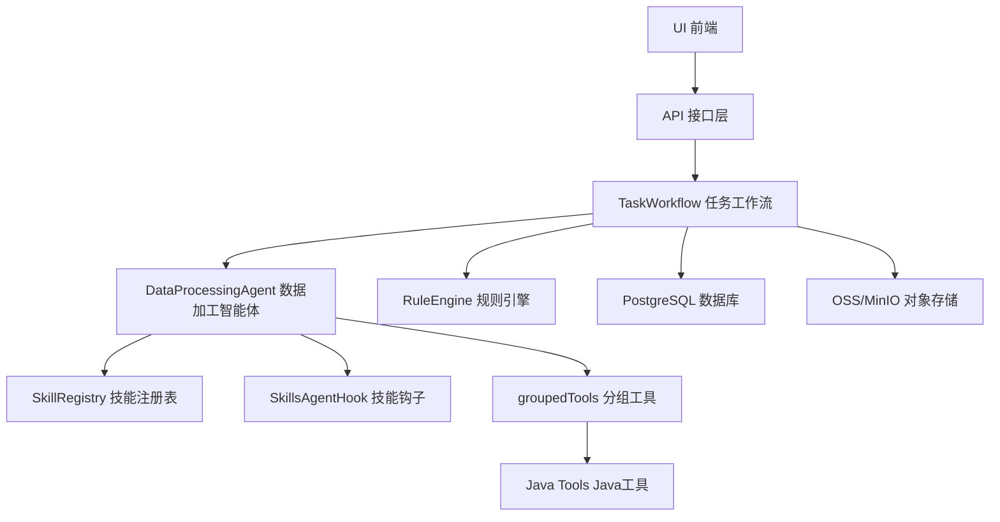
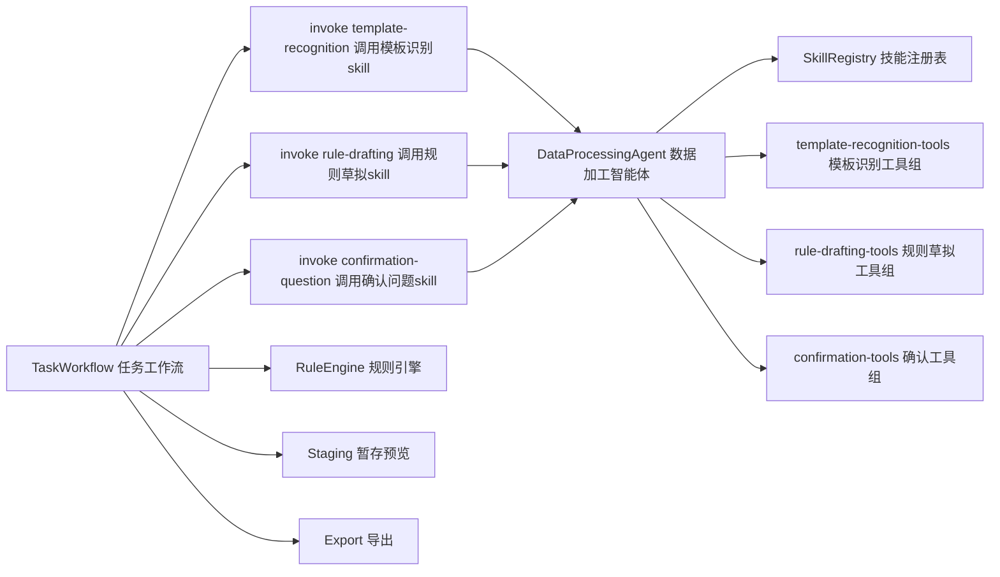
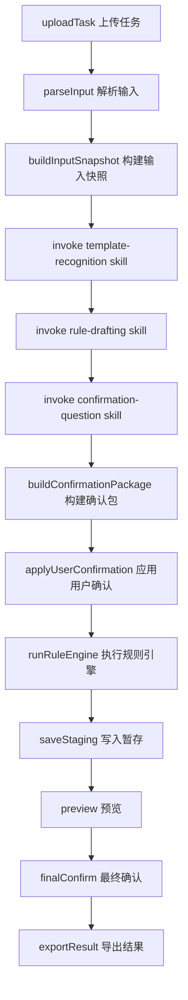
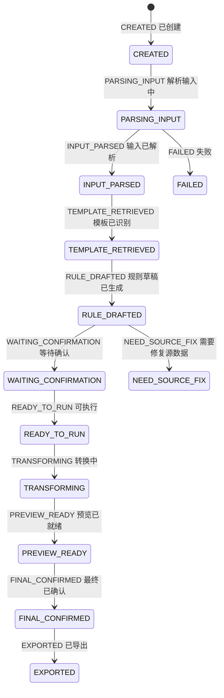

# 基于 Spring AI Alibaba 原生 Skill 体系的最终方案

> 说明
>
> - 本方案严格按 `Spring AI Alibaba` 原生能力设计
> - 不再把 `skill` 伪装成 Java 类本体
> - `skill` 以真实 `SKILL.md` 文件存在
> - Java 主要负责：`tool` 实现、`workflow` 编排、`SkillRegistry` 接入、持久化与规则执行
> - 所有英文标识都附中文说明

---

## 1. 最终结论

你的项目最适合的正式架构是：

`单智能体 + Spring AI Alibaba 原生 markdown skill + groupedTools + Java workflow`

具体落位如下：

- `DataProcessingAgent 数据加工智能体`
  作为全系统唯一 AI 智能体

- `SKILL.md 技能文件`
  作为真实 skill 载体

- `groupedTools 分组工具`
  作为 skill 可调用的 Java 能力集合

- `TaskWorkflow 任务工作流`
  作为主业务流程控制器

一句话解释：

- 智能体只有一个
- skill 是 markdown 文件
- tool 是 Java 代码
- workflow 仍由 Java 控制

---

## 2. 采用 Spring AI Alibaba 的哪套能力

本方案建议直接使用 `Spring AI Alibaba Agent Framework` 的以下原生组件：

- `ReactAgent 响应式智能体`
- `SkillRegistry 技能注册表`
- `FileSystemSkillRegistry 文件系统技能注册表`
  或
- `ClasspathSkillRegistry 类路径技能注册表`
- `SkillsAgentHook 技能智能体钩子`
- `SkillPromptAugmentAdvisor 技能提示增强顾问`
- `groupedTools 分组工具`

这几个能力的职责边界是：

- `ReactAgent 响应式智能体`
  负责单智能体运行

- `SkillRegistry 技能注册表`
  负责发现和管理 `SKILL.md`

- `SkillsAgentHook 技能智能体钩子`
  负责把 skill 列表和 `read_skill 读取技能` 工具接入智能体

- `groupedTools 分组工具`
  负责将 Java tools 绑定给指定 skill

- `SkillPromptAugmentAdvisor 技能提示增强顾问`
  负责把技能目录注入上下文

---

## 3. 为什么不是“一个 skill = 整个数据加工”

不建议把整个数据加工系统定义成一个 skill，原因有三点：

1. `skill` 在 Spring AI Alibaba 里更像“可复用能力说明包”，不是整个系统本身。
2. `数据加工` 是业务总目标，跨度太大，包含模板识别、规则草拟、确认、执行、预览、导出，已经超出单个 skill 的合理粒度。
3. 如果把整个系统定义成一个 skill，会导致 skill 过大、提示词过长、tools 暴露过宽、治理困难。

更合理的方式是：

- 整个系统有一个 `DataProcessingAgent 数据加工智能体`
- 该智能体在不同场景下读取不同 `SKILL.md`

所以：

- `数据加工` 是 agent 级概念
- `模板识别`、`规则草拟`、`确认问题生成` 是 skill 级概念
- `读取快照`、`读取模板目录`、`校验DSL` 是 tool 级概念

---

## 4. 整体全景图



这个图的关键意思是：

- `workflow` 决定什么时候调用 agent
- `agent` 决定当前读取哪个 skill
- `skill` 决定可以调用哪些 grouped tools
- `tool` 返回受控上下文或执行受控函数
- `rule engine` 负责最终全量加工

---

## 5. 单智能体定义

## 5.1 唯一智能体

### `DataProcessingAgent 数据加工智能体`

这是系统中唯一的 AI 智能体。

它的定位不是：

- 流程引擎
- 数据转换器
- 状态机管理器

它的定位是：

- AI 能力统一入口
- skill 执行入口
- tool 调用入口

## 5.2 单智能体职责

- 读取并理解 `SKILL.md`
- 根据当前阶段调用对应 skill
- 在 skill 允许范围内调用 grouped tools
- 返回结构化结果给 Java workflow

## 5.3 单智能体不负责

- 推进任务状态
- 直接写数据库
- 执行全量规则转换
- 直接导出结果

---

## 6. 最终模式选择：workflow 还是 agentic

## 6.1 结论

本项目应采用：

`Workflow-first with skill-level limited agentic`

中文解释：

- 外层是 `workflow 工作流优先`
- 内层允许 `skill 级小范围自治`

## 6.2 为什么不是强 agentic

你这个系统不适合让智能体接管全流程，原因是：

- 状态机明确
- staging 和确认边界严格
- 规则执行必须确定性
- 模板和规则都必须来自知识库事实源
- 不允许隐藏成功路径

因此：

- 不允许 agent 自由决定是否跳过确认
- 不允许 agent 自由决定是否导出
- 不允许 agent 自由扩展流程

## 6.3 最终边界

- `workflow` 决定流程顺序
- `skill` 决定当前 AI 如何理解任务
- `groupedTools` 决定当前 AI 可以调用什么工具

---

## 7. 最终 SKILL.md 清单

这里定义真实的 markdown skill 清单。

## 7.1 一期必须 skill

### `skills/template-recognition/SKILL.md`

中文名：

- 模板识别技能

作用：

- 基于输入快照和模板目录识别模板

允许使用的工具组：

- `template-recognition-tools 模板识别工具组`

输出：

- `templateCode 模板编码`
- `sceneCode 场景编码`
- `countryCode 国家编码`
- `confidence 置信度`
- `alternatives 候选项`
- `needUserConfirm 是否需要用户确认`

### `skills/rule-drafting/SKILL.md`

中文名：

- 规则草拟技能

作用：

- 基于模板、样本行和规则知识草拟 DSL

允许使用的工具组：

- `rule-drafting-tools 规则草拟工具组`

输出：

- `draftDsl 草稿DSL`
- `ambiguousMappings 模糊映射`
- `missingFields 缺失字段`
- `defaultSuggestions 默认值建议`
- `blockingIssues 阻断问题`

### `skills/confirmation-question/SKILL.md`

中文名：

- 确认问题生成技能

作用：

- 把模板冲突、规则歧义和数据问题整理成单轮确认包

允许使用的工具组：

- `confirmation-tools 确认工具组`

输出：

- `questions 问题列表`
- `questionType 问题类型`
- `options 选项`
- `recommendedOption 建议选项`

## 7.2 二期可选 skill

### `skills/tax-screenshot-extraction/SKILL.md`

中文名：

- 税局截图提取技能

作用：

- 处理税局网站截图特例

工具组：

- `tax-screenshot-tools 税局截图工具组`

### `skills/knowledge-import-assist/SKILL.md`

中文名：

- 知识导入辅助技能

作用：

- 解析知识包上传时的自然语言说明

### `skills/rule-explanation/SKILL.md`

中文名：

- 规则解释技能

作用：

- 将规则草稿翻译成可读说明

---

## 8. 每个 SKILL.md 的推荐标准结构

为了统一治理，建议每个 skill 文件都按下面结构组织：

```md
# Skill Name 技能名称

## Purpose 技能目的

## When To Use 使用时机

## Input Expectations 输入要求

## Allowed Tools 允许工具

## Output Contract 输出契约

## Constraints 约束

## Forbidden Actions 禁止事项

## Examples 示例
```

这部分很重要，因为这才是“真 skill”。

---

## 9. groupedTools 最终清单

这一节是整份方案最关键的部分之一，因为它直接决定 Spring AI Alibaba 里 skill 与 tool 怎么绑定。

## 9.1 `template-recognition-tools 模板识别工具组`

包含：

- `LoadInputSnapshotTool 加载输入快照工具`
- `LoadSampleRowsTool 加载样本行工具`
- `ReadTemplateCatalogTool 读取模板目录工具`
- `LookupHeaderAliasesTool 查询表头别名工具`

用途：

- 给 `template-recognition/SKILL.md` 使用

## 9.2 `rule-drafting-tools 规则草拟工具组`

包含：

- `LoadInputSnapshotTool 加载输入快照工具`
- `ReadRuleKnowledgeTool 读取规则知识工具`
- `BuildRuleDslSkeletonTool 构建规则DSL骨架工具`
- `ValidateDraftDslTool 校验草稿DSL工具`
- `LoadAllowedTransformsTool 加载允许转换类型工具`

用途：

- 给 `rule-drafting/SKILL.md` 使用

## 9.3 `confirmation-tools 确认工具组`

包含：

- `LoadTaskContextTool 加载任务上下文工具`
- `LoadConfirmationConstraintsTool 加载确认约束工具`

用途：

- 给 `confirmation-question/SKILL.md` 使用

## 9.4 `tax-screenshot-tools 税局截图工具组`

包含：

- `LoadTaxScreenshotSchemaTool 加载税局截图结构工具`
- `LoadOcrBlocksTool 加载OCR文本块工具`

用途：

- 给 `tax-screenshot-extraction/SKILL.md` 使用

---

## 10. Java Tool 最终清单

下面是建议正式实现的 Java tools。

## 10.1 一期必须 tools

### `LoadInputSnapshotTool 加载输入快照工具`

作用：

- 读取统一输入快照

### `LoadSampleRowsTool 加载样本行工具`

作用：

- 返回样本行供模板识别和规则草拟使用

### `ReadTemplateCatalogTool 读取模板目录工具`

作用：

- 读取 `template_catalog.md` 或其数据库镜像

### `LookupHeaderAliasesTool 查询表头别名工具`

作用：

- 返回表头别名、语言、国家等辅助信息

### `ReadRuleKnowledgeTool 读取规则知识工具`

作用：

- 读取 `scene/country/template` 下的规则知识

### `BuildRuleDslSkeletonTool 构建规则DSL骨架工具`

作用：

- 构建统一骨架，限制模型随意发明 DSL 结构

### `ValidateDraftDslTool 校验草稿DSL工具`

作用：

- 校验草稿 DSL 合法性

### `LoadAllowedTransformsTool 加载允许转换类型工具`

作用：

- 返回允许的 transform 类型集合

### `LoadTaskContextTool 加载任务上下文工具`

作用：

- 给确认问题生成 skill 提供任务上下文

## 10.2 二期可选 tools

### `LoadConfirmationConstraintsTool 加载确认约束工具`

作用：

- 返回确认问题组织规则

### `LoadTaxScreenshotSchemaTool 加载税局截图结构工具`

作用：

- 返回税局截图固定 schema

### `LoadOcrBlocksTool 加载OCR文本块工具`

作用：

- 提供 OCR 文本块详情

---

## 11. Skill 与 groupedTools 的映射表

| Skill 文件 | 对应工具组 |
|---|---|
| `skills/template-recognition/SKILL.md` | `template-recognition-tools 模板识别工具组` |
| `skills/rule-drafting/SKILL.md` | `rule-drafting-tools 规则草拟工具组` |
| `skills/confirmation-question/SKILL.md` | `confirmation-tools 确认工具组` |
| `skills/tax-screenshot-extraction/SKILL.md` | `tax-screenshot-tools 税局截图工具组` |

这里的关键设计思想是：

- 不是所有 tool 对所有 skill 全量开放
- 而是按 skill 分组暴露

这正是 `groupedTools` 的价值。

---

## 12. workflow 与 agent 的边界图



这张图对应的最终边界是：

- `workflow` 负责何时调用 skill
- `agent` 负责执行 skill
- `skill` 负责约束模型行为
- `groupedTools` 负责限制可调用工具范围
- `rule engine` 不属于 agent

---

## 13. 任务主流程



要点：

- AI 只参与 D、E、F 三步
- 其余仍由 Java workflow 掌控

---

## 14. 状态机仍归 workflow 所有



重要结论：

- 状态机不是 skill 的一部分
- 状态机不是 agent 的一部分
- 状态机属于 Java workflow

---

## 15. 你最终应该怎么实施

如果你现在要按这个方案正式开工，建议实施顺序如下：

### 第一步

先确定最终 skill 清单：

- `template-recognition`
- `rule-drafting`
- `confirmation-question`

### 第二步

确定每个 skill 的 `SKILL.md` 模板结构。

### 第三步

确定 grouped tools：

- `template-recognition-tools`
- `rule-drafting-tools`
- `confirmation-tools`

### 第四步

由 Java 实现这些 tools，并接入 `Spring AI Alibaba`

### 第五步

由 Java `TaskWorkflow` 编排：

- 调 skill
- 收结果
- 生成确认包
- 执行规则引擎

---

## 16. 最终拍板建议

我作为 agent 方向给你的最终专业建议是：

1. 整个 AI 数据加工定义成一个 `DataProcessingAgent 数据加工智能体`。
2. `skill` 必须采用 `Spring AI Alibaba` 原生 `SKILL.md` 体系。
3. `模板识别`、`规则草拟`、`确认问题生成` 应定义为独立 skill，而不是 tools。
4. `读取快照`、`读取模板目录`、`读取规则知识`、`校验DSL` 这些才定义为 Java tools。
5. 外层采用 `workflow-first`，不要做强自治 `agentic mode`。
6. 用 `groupedTools` 做 skill 级别的工具隔离，这是整个方案稳定性的关键。

如果压缩成一句话，就是：

`一个 agent，多个真实 SKILL.md，按 skill 分组暴露 tools，外层由 Java workflow 控制。`

