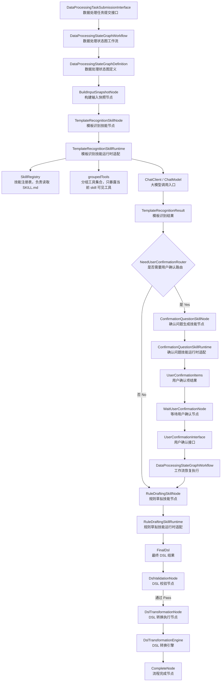
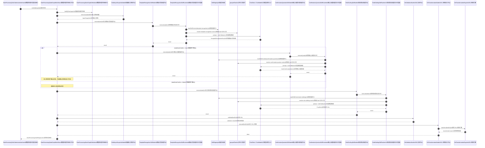
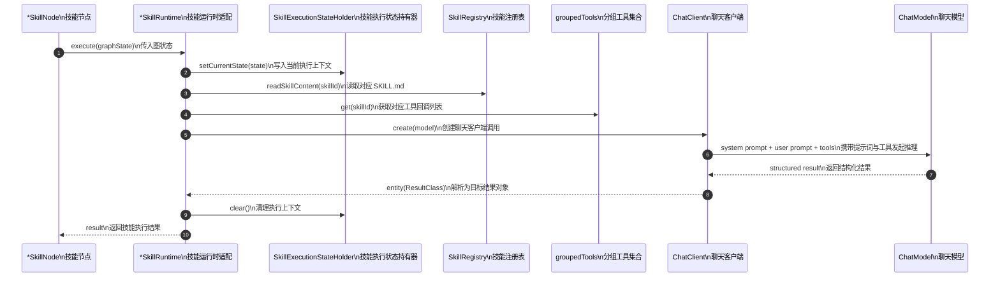

# Spring AI Alibaba StateGraph Skill 执行时序补充说明

> 说明
>
> - 本文档是对 `SPRING_AI_ALIBABA_STATEGRAPH_SKILL_DESIGN_CN.md` 的补充。
> - 重点回答“核心类的运行先后顺序、调用关系是什么”。
> - 图中的英文类名都补充了中文注释，便于直接用于评审和沟通。

---

## 1. 核心类运行先后顺序

下面这张图描述的是“提交任务后，到生成最终 DSL 并执行转换”为止的主链路先后顺序。

---

## 2. 主链路调用时序图

下面这张时序图描述“任务提交后”各核心类之间的调用关系，以及它们的前后顺序。

---

## 3. 三个 SkillNode 的内部调用关系

这张图专门描述单个 `SkillNode` 内部是如何继续下钻到 `SkillRuntime`、`SkillRegistry`、`groupedTools` 和模型调用层的。

---

## 4. 运行顺序总结

可以把当前方案的核心类顺序概括为：

1. `Interface` 接收请求。
2. `Workflow` 启动或恢复 `StateGraph`。
3. `StateGraphDefinition` 决定下一步该执行哪个节点。
4. 普通节点直接处理确定性逻辑，例如构建快照、DSL 校验、DSL 转换。
5. `SkillNode` 只负责把当前 `graphState` 交给对应的 `*SkillRuntime`。
6. `*SkillRuntime` 读取 `SKILL.md`、解析当前 skill 可见工具、再发起模型调用。
7. `Tool` 只在当前 skill 的允许范围内暴露给模型。
8. `Workflow` 根据 skill 输出结果继续路由到下一节点。

---

## 5. 评审时建议重点看什么

- `Workflow` 是否只负责流程推进，而不是掺入具体 prompt 细节。
- `SkillNode` 是否只绑定一个明确的 skill。
- `*SkillRuntime` 是否只负责“技能执行适配”，而不是承担主流程路由。
- `groupedTools` 是否真正限制了每个 skill 的工具可见范围。
- `DslValidationNode`、`DslTransformationNode` 是否仍然保持确定性执行，而不是重新交给模型判断。

