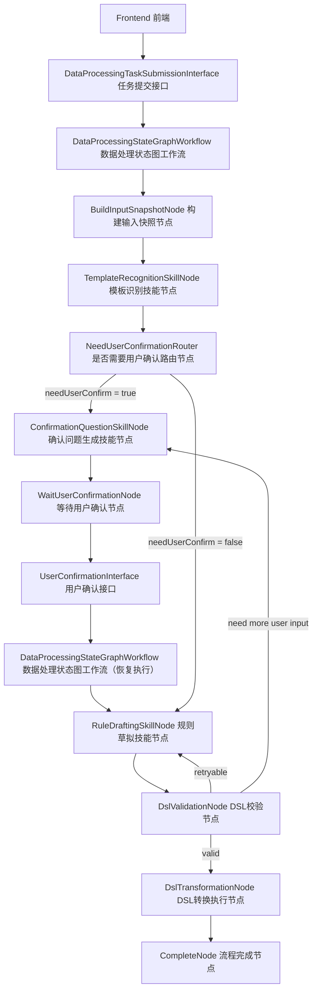

# Spring AI Alibaba StateGraph + Skill 原生编排方案设计

> 说明
>
> - 本文档用于替代“自定义 graph + 自定义 skill loader”方向
> - 本文档聚焦 `StateGraph 工作流编排 + Skill 技能执行 + groupedTools 工具分组`
> - 本文档面向当前一期三技能数据加工场景
> - 所有英文类名均附带中文说明

---

## 1. 设计结论

当前更合理的正式方案应调整为：

`StateGraph 工作流图编排 + Skill 节点执行 + SkillRegistry 技能注册 + SkillsAgentHook 技能挂载 + groupedTools 工具分组 + DSL Transformation Engine DSL 转换引擎`

一句话解释：

- 主流程由 `StateGraph` 控制
- 图中的技能节点本质上是 `skill`
- `skill` 的注册、加载、挂载、工具可见范围尽量使用 Spring AI Alibaba 原生能力
- 最终 DSL 执行仍由 Java 确定性引擎完成

---

## 2. 为什么要调整方案

当前代码中已经出现了一套“自定义 skill 基础设施”：

- `SkillDocumentLoader`
- `SkillRegistry`
- `GroupedToolRegistry`
- `SkillExecutor`

这套实现可以用于概念验证，但不建议作为正式架构继续演进，原因如下：

1. `SkillDocumentLoader` 本质是手工从 classpath 读取 `SKILL.md`，不像 Spring AI Alibaba 原生 skill 加载方式。
2. 自定义 `SkillRegistry` 与 `GroupedToolRegistry` 会重复框架已有能力。
3. 自定义 `SkillExecutor` 本质是“拼 prompt + 拼 tool 结果 + 手工约束输出”，这更接近 prompt orchestration，不是标准 skill orchestration。
4. 当前业务的核心问题并不是“需要一个 graph agent”，而是“需要显式状态图来编排多个确定性节点与技能节点”。

因此，正式方案应该从：

`自定义 graph + 自定义 skill runtime`

调整为：

`Spring AI Alibaba StateGraph + Spring AI Alibaba skill runtime`

---

## 3. 一期目标边界

一期仍然只保留 3 个 skill：

1. `template-recognition`
   模板识别技能
2. `confirmation-question`
   确认问题生成技能
3. `rule-drafting`
   规则草拟技能

一期仍然保留：

- `workflow-first`
- `DDD 四层分层`
- `grouped tools`
- `DSL Transformation Engine`

一期不做：

- 多智能体自治协作
- 让 skill 决定主流程路由
- 用 skill 或其他 AI 机制替代 DSL 确定性执行

---

## 4. 正式架构原则

## 4.1 编排原则

主流程必须由 `StateGraph` 显式控制：

- 哪个节点先执行
- 哪个节点后执行
- 哪些条件下分支
- 哪些条件下暂停
- 哪些条件下恢复
- 哪些条件下回退重试

## 4.2 技能执行原则

`skill` 只负责完成节点内智能任务：

- 模板识别
- 确认项整理
- DSL 草拟

其中必须进一步区分：

- `TemplateRecognitionSkill`
  负责发现最可能模板，并显式暴露识别中的不确定性
- `ConfirmationQuestionSkill`
  负责接住这些不确定性，并将其整理为一次性返回的用户确认题包

一句话：

`TemplateRecognitionSkill 负责发现不确定性，ConfirmationQuestionSkill 负责表达不确定性。`

`skill` 不负责：

- 决定主流程下一跳
- 决定是否结束任务
- 决定是否执行转换引擎

## 4.3 工具暴露原则

每个 `skill` 只能看到与自己绑定的 `groupedTools`：

- `template-recognition` 只能看到识别相关工具
- `confirmation-question` 只能看到确认约束相关工具
- `rule-drafting` 只能看到规则知识与 DSL 草拟相关工具

## 4.4 执行确定性原则

模型负责：

- 判断
- 归纳
- 草拟

Java 负责：

- 状态保存
- 流程恢复
- 路由分支
- DSL 校验
- DSL 转换执行

一句话：

`模型做技能推理，StateGraph 做状态编排，Java 做确定性落地`

---

## 5. 一期 StateGraph 工作流

## 5.1 节点清单

推荐节点如下：

1. `BuildInputSnapshotNode 构建输入快照节点`
2. `TemplateRecognitionSkillNode 模板识别技能节点`
3. `NeedUserConfirmationRouter 是否需要用户确认路由节点`
4. `ConfirmationQuestionSkillNode 确认问题生成技能节点`
5. `WaitUserConfirmationNode 等待用户确认节点`
6. `RuleDraftingSkillNode 规则草拟技能节点`
7. `DslValidationNode DSL校验节点`
8. `DslTransformationNode DSL转换执行节点`
9. `CompleteNode 流程完成节点`

## 5.2 路由规则

- 模板识别完成后：
  - `needUserConfirm = true` -> `ConfirmationQuestionSkillNode`
  - `needUserConfirm = false` -> `RuleDraftingSkillNode`

- 用户确认完成后：
  - `WaitUserConfirmationNode` 恢复到 `RuleDraftingSkillNode`

- DSL 校验完成后：
  - 校验通过 -> `DslTransformationNode`
  - 校验失败但可重试 -> 回到 `RuleDraftingSkillNode`
  - 缺少用户输入 -> 回到 `ConfirmationQuestionSkillNode`

补充解释：

- `TemplateRecognitionSkillNode` 的输出是“识别结论 + 未决字段声明”
- `ConfirmationQuestionSkillNode` 的输出是“用户确认题包”
- 前者不直接面向用户，后者直接面向用户确认环节
- 前者决定“要不要问”，后者决定“问什么、怎么组织成一轮确认”

---

## 6. StateGraph 流程图



---

## 7. 状态对象设计

推荐图状态对象：

`DataProcessingGraphState 数据处理图状态对象`

建议字段：

- `taskId`
- `sourceHeaders`
- `sampleRows`
- `inputSnapshot`
- `templateRecognitionResult`
- `userConfirmationItems`
- `userConfirmationRequest`
- `finalDsl`
- `transformedPreviewRows`
- `workflowStage`
- `retryCount`
- `errorMessages`
- `traceLogs`

设计原则：

- 图状态对象承载流程态数据
- 领域对象承载业务语义
- 仓储负责持久化/恢复图状态或任务会话

进一步说明：

`DataProcessingGraphState` 是这张 `StateGraph` 在运行时流转的统一状态对象。

它的职责不是单纯替代 `TaskSession`，而是承载整条状态图在执行过程中需要共享和传递的上下文，包括：

- 节点输入
- 节点输出
- 中间推理结果
- 路由判断结果
- 用户确认回填结果
- DSL 校验结果
- 转换预览结果
- 错误信息与恢复执行所需上下文

可以把它理解为：

- `TaskSession` 更偏业务会话对象
- `DataProcessingGraphState` 更偏流程执行上下文对象

推荐边界：

- `TaskSession` 负责表达任务会话本身
- `DataProcessingGraphState` 负责表达 StateGraph 运行时状态

如果后续流程状态逐步增多，不建议把所有流程字段都继续塞进 `TaskSession`，否则 `TaskSession` 会逐渐演变成流程容器，削弱它的领域语义。

推荐字段可按下面几类理解：

1. 基础标识
- `taskId`
- `workflowStage`
- `currentNode`

2. 输入相关
- `sourceHeaders`
- `sampleRows`
- `inputSnapshot`

3. 模板识别阶段
- `templateRecognitionResult`
- `needUserConfirm`
- `recognitionReason`

4. 用户确认阶段
- `userConfirmationItems`
- `userConfirmationRequest`

5. DSL 阶段
- `finalDsl`
- `dslValidationPassed`
- `dslValidationErrors`

6. 转换阶段
- `transformedPreviewRows`

7. 流程控制阶段
- `retryCount`
- `errorMessages`
- `traceLogs`

一句话定义：

`DataProcessingGraphState = 数据加工 StateGraph 在运行时流转的统一状态对象，承载节点输入、节点输出、中间结果、流程控制信息和恢复执行上下文。`

---

## 8. Skill 与 Tool 原生绑定方案

## 8.1 不推荐的方式

不建议继续沿用以下思路：

- 手工读取 `SKILL.md`
- 手工维护 skill 注册表
- 手工维护 grouped tool 注册表
- 手工将 tool 结果拼入 prompt

## 8.2 推荐的方式

推荐尽量使用 Spring AI Alibaba 原生能力：

- `SkillRegistry 技能注册表`
- `SkillsAgentHook 技能挂载钩子`
- `groupedTools 工具分组`

每个技能节点内部推荐这样组织：

1. 节点只绑定一个明确的 `skill`
2. skill 通过框架原生 `SkillRegistry` 注册
3. skill 通过框架原生 hook 挂载到 skill 执行链
4. 通过 `groupedTools` 只暴露当前 skill 可见工具
5. 节点对 skill 输出结果进行结构化约束与解析

重要边界：

- `StateGraph` 内部节点是 `skill node`
- `workflow` 内部不引入独立 `agent` 作为一层抽象
- `skill` 是工作流中的技能执行单元
- `tool` 是 skill 可调用的受控能力

---

## 9. 一期 Skill 与 Tool 分组建议

## 9.1 Template Recognition Skill

`template-recognition 模板识别技能`

建议可见工具：

- `InputSnapshotTool 输入快照工具`
- `TemplateCatalogTool 模板目录工具`

职责边界：

- 负责模板识别
- 负责输出 `needUserConfirm`
- 负责输出 `unresolvedTargetFields`
- 不负责生成用户确认问题
- 不负责输出可直接展示给用户的确认包

## 9.2 Confirmation Question Skill

`confirmation-question 确认问题生成技能`

建议可见工具：

- `ConfirmationConstraintTool 确认约束工具`

职责边界：

- 负责把模板识别阶段的未决项整理成 `UserConfirmationItems`
- 负责一次性返回确认问题结构
- 不负责重新识别模板
- 不负责推翻 `TemplateRecognitionSkill` 的识别结论
- 不负责起草 DSL

## 9.3 Rule Drafting Skill

`rule-drafting 规则草拟技能`

建议可见工具：

- `RuleKnowledgeTool 规则知识工具`
- `DraftDslTool DSL骨架工具`

说明：

如果当前项目里 `RuleDslTool` 同时承担“规则知识 + fallback DSL 组装”两种职责，建议后续拆开，避免一个工具承担太多语义。

---

## 10. DDD 四层落位

## 10.1 Interface Layer 接口层

负责：

- REST 请求接收
- 参数校验
- 响应封装

不负责：

- Skill 执行
- 图路由
- DSL 转换

## 10.2 Application Layer 应用层

负责：

- `StateGraph` 启动与恢复
- 流程状态推进
- 路由分支控制
- 仓储调用

典型类：

- `DataProcessingStateGraphWorkflow 数据处理状态图工作流`
  负责同一张 StateGraph 的首次启动与恢复执行。

## 10.3 Domain Layer 领域层

负责：

- `TemplateRecognitionResult`
- `UserConfirmationItems`
- `FinalDsl`
- `WorkflowStage`
- `TaskSession`

## 10.4 Infrastructure Layer 基础设施层

负责：

- 模型配置
- Agent 配置
- Skill registry 配置
- Skills hook 配置
- grouped tools 配置
- DSL transformation engine
- 仓储实现

---

## 11. 推荐类图

```mermaid
classDiagram
    class DataProcessingTaskSubmissionInterface["DataProcessingTaskSubmissionInterface 任务提交接口"] {
        +submit(request) DataProcessingTaskResponse
    }

    class UserConfirmationInterface["UserConfirmationInterface 用户确认接口"] {
        +confirm(request) UserConfirmationResponse
    }

    class DataProcessingStateGraphWorkflow["DataProcessingStateGraphWorkflow 数据处理状态图工作流"] {
        +start(request) DataProcessingTaskResponse
        +resume(request) UserConfirmationResponse
    }

    class DataProcessingStateGraphDefinition["DataProcessingStateGraphDefinition 数据处理状态图定义"] {
        +build() CompiledStateGraph
    }

    class DataProcessingGraphState["DataProcessingGraphState 数据处理图状态对象"]

    class BuildInputSnapshotNode["BuildInputSnapshotNode 构建输入快照节点"]
    class TemplateRecognitionSkillNode["TemplateRecognitionSkillNode 模板识别技能节点"]
    class ConfirmationQuestionSkillNode["ConfirmationQuestionSkillNode 确认问题生成技能节点"]
    class RuleDraftingSkillNode["RuleDraftingSkillNode 规则草拟技能节点"]
    class DslValidationNode["DslValidationNode DSL校验节点"]
    class DslTransformationNode["DslTransformationNode DSL转换执行节点"]

    class SkillRegistry["SkillRegistry 技能注册表"]
    class SkillsAgentHook["SkillsAgentHook 技能挂载钩子"]
    class GroupedToolsConfig["GroupedToolsConfig 分组工具配置"]

    class InputSnapshotTool["InputSnapshotTool 输入快照工具"]
    class TemplateCatalogTool["TemplateCatalogTool 模板目录工具"]
    class HeaderAliasTool["HeaderAliasTool 表头别名工具"]
    class ConfirmationConstraintTool["ConfirmationConstraintTool 确认约束工具"]
    class RuleKnowledgeTool["RuleKnowledgeTool 规则知识工具"]
    class DraftDslTool["DraftDslTool DSL骨架工具"]

    class DslTransformationEngine["DslTransformationEngine DSL转换引擎"]

    DataProcessingTaskSubmissionInterface --> DataProcessingStateGraphWorkflow
    UserConfirmationInterface --> DataProcessingStateGraphWorkflow

    DataProcessingStateGraphWorkflow --> DataProcessingStateGraphDefinition
    DataProcessingStateGraphDefinition --> DataProcessingGraphState

    DataProcessingStateGraphDefinition --> BuildInputSnapshotNode
    DataProcessingStateGraphDefinition --> TemplateRecognitionSkillNode
    DataProcessingStateGraphDefinition --> ConfirmationQuestionSkillNode
    DataProcessingStateGraphDefinition --> RuleDraftingSkillNode
    DataProcessingStateGraphDefinition --> DslValidationNode
    DataProcessingStateGraphDefinition --> DslTransformationNode

    TemplateRecognitionSkillNode --> SkillRegistry
    TemplateRecognitionSkillNode --> SkillsAgentHook
    TemplateRecognitionSkillNode --> GroupedToolsConfig
    ConfirmationQuestionSkillNode --> SkillRegistry
    ConfirmationQuestionSkillNode --> SkillsAgentHook
    ConfirmationQuestionSkillNode --> GroupedToolsConfig
    RuleDraftingSkillNode --> SkillRegistry
    RuleDraftingSkillNode --> SkillsAgentHook
    RuleDraftingSkillNode --> GroupedToolsConfig

    GroupedToolsConfig --> InputSnapshotTool
    GroupedToolsConfig --> TemplateCatalogTool
    GroupedToolsConfig --> HeaderAliasTool
    GroupedToolsConfig --> ConfirmationConstraintTool
    GroupedToolsConfig --> RuleKnowledgeTool
    GroupedToolsConfig --> DraftDslTool

    DslTransformationNode --> DslTransformationEngine
```



---

## 12. 对当前代码的判断

当前代码中的以下实现应视为“过渡实现”，不建议长期保留：

- `SkillDocumentLoader`
- 自定义 `SkillRegistry`
- 自定义 `GroupedToolRegistry`
- 自定义 `SkillExecutor`
- 轻量自定义 `DataProcessingGraph`

原因不是这些类“完全错误”，而是它们会让项目逐渐偏离 Spring AI Alibaba 的原生能力模型。

---

## 13. 迁移建议

推荐按下面顺序迁移：

1. 先保留现有领域模型与接口层不变
2. 将应用层的 `DataProcessingGraph` 重构为 `StateGraph` 编排
3. 将每个技能节点改为 `skill + groupedTools + 原生 skill registry/hook`
4. 删除自定义 `SkillDocumentLoader / SkillRegistry / GroupedToolRegistry / SkillExecutor`
5. 将 `RuleDslTool` 逐步拆分为规则知识工具与 fallback DSL 组装能力
6. 最后补充 DSL 校验回环与恢复逻辑

---

## 14. 一句话总结

这个场景真正适合的是：

`StateGraph 编排工作流`

而不是：

`graph agent 统管一切`

并且要继续坚持一个明确边界：

`工作流内部只有 skill，没有 agent`

skill 层也应该尽量回归 Spring AI Alibaba 原生机制，而不是继续手工搭建一个自定义 runtime。

---

## 15. 开发落地清单

本节用于补充后续开发时的直接落地指引。

说明：

- 本节只做补充，不替代前文设计内容
- 前文中的架构原则、流程图、类图、迁移建议仍然全部有效
- 本节重点回答“接下来代码应该怎么建、怎么迁、怎么收口”

## 15.1 建议新增的核心类

## Application Layer 应用层

建议新增：

- `DataProcessingStateGraphWorkflow 数据处理状态图工作流`
  负责任务提交入口、初始化图状态、启动 StateGraph 执行，以及用户确认后的恢复执行入口。
- `DataProcessingStateGraphDefinition 数据处理状态图定义`
  负责定义节点、边、条件路由并编译 StateGraph。

## Application Layer / graph node 技能节点

建议新增：

- `BuildInputSnapshotNode 构建输入快照节点`
- `TemplateRecognitionSkillNode 模板识别技能节点`
- `ConfirmationQuestionSkillNode 确认问题生成技能节点`
- `RuleDraftingSkillNode 规则草拟技能节点`
- `DslValidationNode DSL校验节点`
- `DslTransformationNode DSL转换执行节点`

说明：

- `SkillNode` 只负责调用一个明确 skill
- `DslValidationNode` 和 `DslTransformationNode` 属于确定性节点，不属于 skill

## Domain Layer 领域层

建议保留并继续演进：

- `TaskSession`
- `TemplateRecognitionResult`
- `UserConfirmationItems`
- `FinalDsl`
- `WorkflowStage`

建议新增或补强：

- `DataProcessingGraphState 数据处理图状态对象`
  说明：
  可以放在 application 层，也可以作为偏流程态对象独立放置；如果团队希望 domain 只保留纯业务对象，则更推荐放在 application 层。

## Infrastructure Layer 基础设施层

建议新增：

- `SkillRuntimeConfig 技能运行时配置`
  负责 Spring AI Alibaba skill registry、skills hook、grouped tools 配置。
- `StateGraphConfig 状态图配置`
  负责 StateGraph 运行时相关配置。
- `TemplateRecognitionSkillRuntime 模板识别技能运行时适配`
- `ConfirmationQuestionSkillRuntime 确认问题技能运行时适配`
- `RuleDraftingSkillRuntime 规则草拟技能运行时适配`

说明：

- 这里的 `*SkillRuntime` 不是 agent
- 它只是“Spring AI Alibaba 原生 skill 执行链”的适配层

---

## 15.2 建议保留的现有类

建议保留：

- `InputSnapshotTool`
- `TemplateCatalogTool`
- `HeaderAliasTool`
- `ConfirmationConstraintTool`
- `RuleDslTool`
- `DslTransformationEngine`
- `TaskSessionRepository`
- `InMemoryTaskSessionRepository`
- 现有 request/response DTO
- 现有 domain model

说明：

- 这些类多数仍然符合“tool / engine / repository / domain object”的职责
- 后续主要调整的是编排方式和 skill runtime 接入方式，而不是把这些基础件推倒重来

---

## 15.3 建议收口或替换的现有类

以下类如果仍然存在于代码库中，应按新方案逐步收口或替换：

- `SkillService`
  建议最终演进为“面向 workflow 的 skill 调用门面”或直接被 `SkillNode` 替代。
- `DataProcessingWorkflow`
  建议由 `DataProcessingStateGraphWorkflow` 替代。
- `UserConfirmationWorkflow`
  建议由 `DataProcessingStateGraphWorkflow` 替代。

说明：

- 如果保留这些类，建议仅作为兼容层或过渡入口
- 不建议继续在这些类内部堆积真实编排逻辑

---

## 15.4 skill 文件与工具绑定落位建议

`skills/` 目录建议继续保留在资源层，例如：

```text
src/main/resources/skills
├─ template-recognition
│  └─ SKILL.md
├─ confirmation-question
│  └─ SKILL.md
└─ rule-drafting
   └─ SKILL.md
```

建议保持如下绑定关系：

- `template-recognition`
  绑定 `InputSnapshotTool + TemplateCatalogTool + HeaderAliasTool`
- `confirmation-question`
  绑定 `ConfirmationConstraintTool`
- `rule-drafting`
  绑定 `RuleDslTool`，后续再拆分为更细粒度工具

说明：

- `skill` 文件本身建议继续放在 `resources`
- 不建议将 `SKILL.md` 上移到 domain 层
- domain 层只需要保留 skill 对应的业务语义和输入输出契约

---

## 15.5 推荐迁移顺序

推荐按下面顺序落地：

1. 保留现有 domain model、tool、engine、repository 不动。
2. 新建 `DataProcessingStateGraphDefinition`，先把流程图结构定义出来。
3. 新建 `DataProcessingStateGraphWorkflow`。
4. 新建 `BuildInputSnapshotNode / TemplateRecognitionSkillNode / ConfirmationQuestionSkillNode / RuleDraftingSkillNode / DslValidationNode / DslTransformationNode`。
5. 将 skill 执行接到 Spring AI Alibaba 原生 skill runtime。
6. 将 grouped tools 配置到各 skill。
7. 用新 workflow 替换旧 workflow 入口。
8. 最后删除过渡期兼容代码。

---

## 15.6 开发时的边界检查清单

每次开发或评审时，建议对照下面的清单：

1. 这个类是在编排流程，还是在表达业务语义？
   如果是编排流程，优先放 application 层。

2. 这个类是在描述 skill 的业务意图，还是在接框架运行时？
   如果是框架运行时，优先放 infrastructure 层。

3. 这个节点是不是一个真正的 skill node？
   如果不是，就不要把它命名成 `*SkillNode`。

4. 这个逻辑是不是应该由 `StateGraph` 路由控制？
   如果是，就不要把路由逻辑塞回 skill。

5. 这个动作是不是确定性执行？
   如果是，就优先保留在 Java engine / validator / repository 中。

---

## 15.7 一句话落地原则

后续开发时可以始终用下面这句话校验实现方向：

`StateGraph 负责流程，SkillNode 负责技能执行，Tool 负责受控能力，Domain 负责业务语义，Java 负责确定性落地。`
